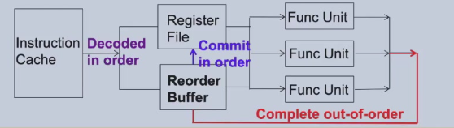

### 流水线冲突

- 结构冲突
- 数据冲突
- 控制冲突

### Reorder Buffer

定义：当指令完成时，指令的结果被写回寄存器或内存中。ROB确保指令按照程序顺序提交，即使它们可能以不同的顺序完成。

- [x] 执行的时候会出现乱序结束 
- [x] 提交的时候会按照程序顺序提交

从而达到: 顺序开始 ->乱序执行 -> 顺序提交

ROB Entry: 

#### 错误依赖
寄存器重命名：将寄存器重命名为ROB中的条目，以消除寄存器之间的假依赖。

