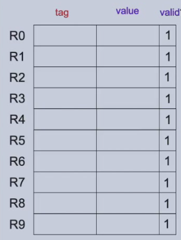
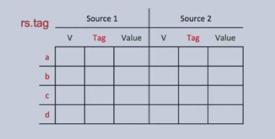

---	
comments: true	
---	
	
# 托马斯算法（Tomasulo Algorithm）	
	
目标：解决**乱序执行**中的数据依赖问题。类似 Dataflow 模型 —— "fire" 指令时检查所有输入是否准备好，准备好就执行，否则等待。	
	
## 核心思想	
	
将依赖指令"移开"，让独立指令先执行。	
	
**Key Idea**: Move the dependent instructions out of the way of independent ones.	
	
## 三大组件	
	
### 1. Register Rename Table（寄存器重命名表）	
	
消除**假依赖**（WAR / WAW），用 Tag 代替寄存器名。	
	
- `valid = 1`：寄存器的值已准备好，可直接使用	
- `valid = 0`：寄存器值还在计算中，需等待对应 Tag 的广播	
	
	
	
### 2. Reservation Station（保留站）	
	
每条指令进入保留站，等待操作数就绪后"发射"执行。	
	
	
	
存放内容：	
- 操作码（Op）	
- 源操作数（Value 或 Tag）	
- 目标寄存器 Tag	
	
### 3. Common Data Bus（公共数据总线）	
	
每次有指令完成时，将结果和 Tag **广播**到 CDB。所有等待该 Tag 的保留站同时接收数据。	
	
## 算法三阶段	
	
### 1. Issue（发射 / ID 阶段）	
	
- 从指令队列取指令	
- 从重命名表获取操作数（值或 Tag）	
- 分配保留站条目	
- 若保留站满 → 停顿	
	
### 2. Execute（执行 / EX 阶段）	
	
- 等待所有操作数就绪	
- 操作数就绪后立即开始执行	
- 多条指令可以在不同功能单元中**同时执行**（乱序）	
	
### 3. Write Back（写回 / WB 阶段）	
	
- 计算完成，将结果 + Tag 广播到 CDB	
- 所有等待该 Tag 的保留站接收结果	
- 更新重命名表	
	
## 与 Scoreboard 对比	
	
| | Scoreboard | Tomasulo |	
|--|-----------|----------|	
| 假依赖处理 | 停顿 | 寄存器重命名（消除） |	
| 结果传递 | 寄存器文件 | CDB 广播 |	
| 复杂度 | 集中式控制 | 分布式保留站 |	
	
## 为什么 Tomasulo 有效？	
	
- **寄存器重命名**：消除 WAR / WAW 假依赖	
- **CDB 广播**：直接从完成单元传递结果，不需经过寄存器	
- **分布式调度**：各保留站自主判断操作数就绪