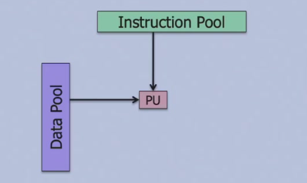
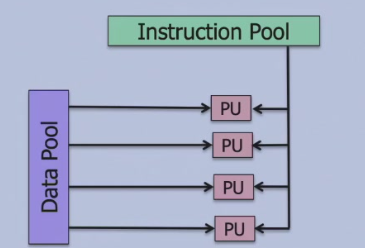
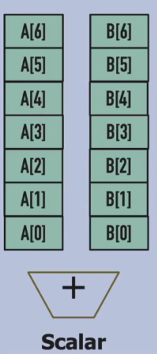
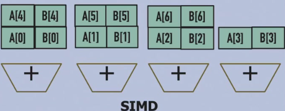

---	
comments: true	
---	
	
# 超标量与向量化	
	
## 超标量（Superscalar）	
	
处理器在**同一时钟周期**内同时发射多条独立指令。	
	
- **IPC**（Instructions Per Cycle）：每周期执行指令数	
- 超标量架构使 IPC > 1	
	
### 优劣	
	
优点：	

- 高指令吞吐	
- 高 IPC	
	
缺点：	

- 复杂依赖检查	
- 更多硬件开销（多端口寄存器文件、更多功能单元）	
	
## 向量化（Vectorization）	
	
**SIMD（Single Instruction Multiple Data）**：单条指令同时处理多个数据元素。	
	
### Flynn 分类法	
	
| 类型 | 含义 | 示例 |	
|------|------|------|	
| **SISD** | 单指令单数据 | 传统 CPU |	
| **SIMD** | 单指令多数据 | GPU、向量处理器 |	
| **MISD** | 多指令单数据 | 容错系统 |	
| **MIMD** | 多指令多数据 | 多核 CPU |	
	
	
	
	
### SIMD 示例	
	
计算 `A[6..0] + B[6..0]`：	
	
**标量（Scalar）**：7 条 add 指令	
	
	
**SIMD**：1 条向量 add 指令，7 个加法器并行	
	
	
## 多线程（Multithreading）	
	
在一个核上交替执行多个线程，隐藏延迟。	
	
| 类型 | 切换时机 | 特点 |	
|------|----------|------|	
| **细粒度（Fine-Grained）** | 每个周期切换 | 公平，硬件复杂 |	
| **粗粒度（Coarse-Grained）** | 遇到长停顿切换 | 简单，长延迟仍受影响 |	
| **SMT（同时多线程）** | 同时执行多线程指令 | 充分利用超标量能力 |	
	
## 多核（Multi-Core）	
	
在单个芯片上集成多个处理器核（摩尔定律驱动）。	
	
- **共享内存（Shared Memory）**：所有核共享同一地址空间	
- **分布式内存（Distributed Memory）**：每个核有自己的本地内存	
	
### 多核挑战	
	
- Cache 一致性（Coherence）	
- 并行编程难度	
- Amdahl 定律限制可扩展性