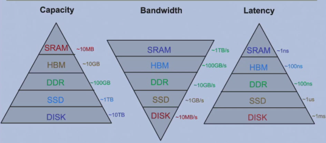
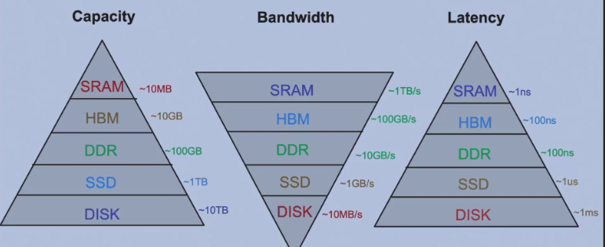
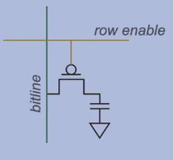
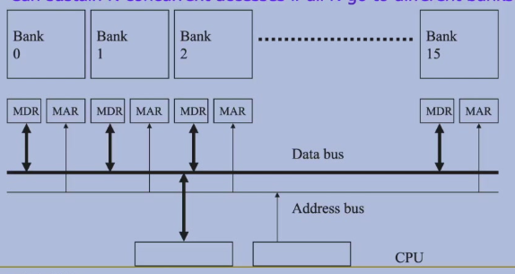

---	
comments : true	
---	
	
# 内存系统	
	
## 内存层次结构	
	
编程者视角：只用 Load 和 Store 指令。	
	
### 理想内存	
	
- 零延迟	
- 无限存储	
- 无限带宽	
- 零开销	
	
现实：采用层次结构逼近理想。	
	
	
	
## 内存层次结构	
	
| 层级 | 典型大小 | 延迟 |	
|------|----------|------|	
| 寄存器 | ~1 KB | 0 cycle |	
| L1 Cache | 32-64 KB | ~4 cycles |	
| L2 Cache | 256-512 KB | ~12 cycles |	
| L3 Cache | 2-16 MB | ~40 cycles |	
| 主存（DRAM） | 8-64 GB | ~200 cycles |	
| SSD | 256 GB-2 TB | ~2×10⁵ cycles |	
| HDD | 1-10 TB | ~10⁷ cycles |	
	
	
	
## Cache	
	
### 映射方式	
	
| 方式 | 特点 | 冲突 |	
|------|------|------|	
| **直接映射** | 每个块只有唯一位置 | 高 |	
| **全相联** | 可放任意位置 | 无（但比较器多） |	
| **组相联** | 每组 N 路，块可放组内任意路 | 折中 |	
	
### Cache Miss 类型	
	
- **Compulsory（冷启动）**：首次访问必然缺失	
- **Capacity（容量）**：Cache 不够大装不下工作集	
- **Conflict（冲突）**：多个块映射到同一位置	
	
### 写入策略	
	
- **Write-Through**：同时写 Cache 和主存 → 慢但一致	
- **Write-Back**：只写 Cache，替换时写回 → 快但需 dirty bit	
	
## SRAM vs DRAM	
	
### SRAM（静态随机访问存储器）	
	
- 用 6 个晶体管构成双稳态电路保存数据	
- 优势：速度快，随机访问高效	
- 用途：Cache	
	
### DRAM（动态随机访问存储器）	
	
- 用电容保存电荷表示数据	
- 需要周期**刷新**（Refresh）	
	
	
	
### DDR（Double Data Rate）	
	
时钟上升沿和下降沿都传输数据，双倍带宽。经历 DDR → DDR2 → DDR3 → DDR4 → DDR5。	
	
### HBM（High Bandwidth Memory）	
	
高带宽内存：3D 堆叠 DRAM 芯片，通过硅中介层连接。带宽远超 DDR，用于 GPU / AI 加速器。	
	
## Memory Banking	
	
将内存分成多个 Bank，每个 Bank 可独立访问。	
	
	
	
地址取余 Bank 数量得到 Bank ID → 连续地址访问可并行。	
	
## SSD vs HDD	
	
| | SSD | HDD |	
|--|-----|-----|	
| 原理 | NAND Flash | 磁盘旋转 + 磁头 |	
| 随机读 | 快（无机械部件） | 慢（需寻道） |	
| 顺序读 | 快 | 较快 |	
| 耐久性 | 写入寿命有限 | 机械磨损 |	
	
## 虚拟内存	
	
将逻辑地址空间映射到物理内存，支持：	
- 地址空间隔离（每个进程独立地址空间）	
- 按需调页（Demand Paging）	
- TLB（Translation Lookaside Buffer）：页表缓存，加速地址转换