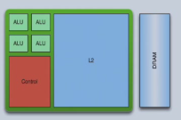
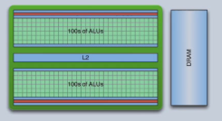

---	
comments : true	
---	
	
# GPU	
	
## 为什么需要 GPU？	
	
- CPU 擅长复杂控制流和低延迟任务，但计算密度有限	
- 图形渲染 / AI 训练需要**大量并行计算**	
- GPU 提供远超 CPU 的吞吐量	
	
## GPU vs CPU 架构对比	
	
| | CPU | GPU |	
|--|-----|-----|	
| 核心数 | 少量（4-16）复杂大核 | 大量（数千）简单小核 |	
| Cache | 大量（MB 级） | 少量（KB 级） |	
| 控制 | 复杂分支预测 / 乱序执行 | 简单，依赖并行隐藏延迟 |	
| 内存 | 大且慢（DDR） | 小且快（GDDR / HBM） |	
| 擅长 | 串行任务、低延迟 | 并行任务、高吞吐 |	
	
	
	
	
## SIMT 模型	
	
**Single Instruction Multiple Thread**：GPU 的编程模型。	
	
- 一组线程以 **Warp**（NVIDIA，32 线程）/ **Wavefront**（AMD，64 线程）为单位执行	
- 同一 Warp 内所有线程执行相同指令，但操作不同数据	
- 分支时：不同路径串行执行，屏蔽不活跃线程 → **线程束分化（Warp Divergence）**	
	
## GPU 内存层次	
	
| 内存类型 | 大小 | 延迟 | 作用域 |	
|----------|------|------|--------|	
| **全局内存（Global）** | GB 级 | 高（~500 cycles） | 所有线程 |	
| **共享内存（Shared）** | 几十 KB/SM | 低（~20 cycles） | 同一 Block |	
| **局部内存（Local）** | 寄存器溢出 | 同 Global | 单线程 |	
| **常量内存（Constant）** | 64 KB | 低（有 Cache） | 所有线程 |	
| **纹理内存（Texture）** | 同 Global | 低（有 Cache） | 所有线程 |	
| **寄存器（Register）** | 最稀缺 | 0 cycle | 单线程 |	
	
## 线程层次	
	
```	
Grid（网格）	
├── Block 0（线程块）	
│   ├── Thread 0	
│   ├── Thread 1	
│   └── ...	
├── Block 1	
│   └── ...	
└── ...	
```	
	
- **Block** 内线程可同步（__syncthreads()），共享 Shared Memory	
- 不同 Block 之间独立运行，不可同步	
- **Occupancy**：SM 上活跃 Warp 数量 / 最大 Warp 数量，越高越好（隐藏延迟）	
	
## GPU 计算流程	
	
1. CPU 向 GPU 显存传输数据（PCIe）	
2. GPU 启动 Kernel，网格中大量线程并行执行	
3. GPU 将结果传回 CPU 内存	
	
## 延迟隐藏（Latency Hiding）	
	
GPU 通过快速切换 Warp 来隐藏内存访问延迟。当一个 Warp 等待数据时，SM 立即切换到另一个就绪的 Warp。	
	
:arrow_right: 这要求足够多的活跃 Warp（高 Occupancy）。