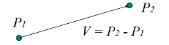

---	
comments : true	
---	
	
# 数学基础	
	
!!! tip "核心要点"	
    计算机图形学中，**矩阵变换**和**向量运算**贯穿始终。变换矩阵乘法从右向左执行，齐次坐标用 $w=1$ 表示点、$w=0$ 表示向量。	
	
## 向量	
	
### 运算	
	
- **内积（Dot Product）**：$\bm{u}\cdot \bm{v} = \sum\limits_{i}u_iv_i = \|\bm{u}\|\|\bm{v}\|\cos\theta$	
- **叉乘（Cross Product）**：$\bm{u}\times\bm{v} = \begin{vmatrix} \bm{i} & \bm{j} & \bm{k} \\ u_x & u_y & u_z \\ v_x & v_y & v_z \end{vmatrix}$	
	
叉乘结果垂直于 $\bm{u}$ 和 $\bm{v}$ 所在平面，方向由右手定则确定：	
$$\|\bm{u}\times\bm{v}\| = \|\bm{u}\|\|\bm{v}\|\sin\theta$$	
	
- **Scalar Triple Product**：$\bm{A}\cdot(\bm{B}\times\bm{C})$ 表示三向量围成的平行六面体体积	
	
### 向量运算的几何意义	
	
| 运算 | 几何意义 |	
|------|----------|	
| $\bm{u}\cdot\bm{v} = 0$ | 两向量垂直 |	
| $\bm{u}\times\bm{v} = \bm{0}$ | 两向量平行 |	
| $\bm{u}\cdot(\bm{v}\times\bm{w})$ | 三向量共面判定（$=0$ 则共面） |	
	
!!! warning "常见误区"	
    叉乘结果**是向量**不是标量，方向由右手定则确定。2D 中叉乘退化为标量，但其实质仍是垂直于平面的向量。	
	
## 点与向量	
	
### 1. 点	
	
空间中的一个位置，无方向无大小。	
	
### 2. 点与向量的关系	
	
两点作差得到向量：$\bm{V} = P_1 - P_2$	
	
	
	
## 基本几何图元	
	
### 三角形	
	
**重心坐标** 表示三角形内一点：	
	
$$P = \alpha P_1 + \beta P_2 + \gamma P_3$$	
	
$$\alpha + \beta + \gamma = 1,\quad 0\leq (\alpha,\beta,\gamma)\leq 1$$	
	
!!! tip "应用"	
    重心坐标用于三角形内部插值（颜色、法线、UV），光线-三角形求交也依赖于此。	
	
### 多边形	
	
通常考虑**凸多边形**（内部任意两点连线仍在内部）。	
	
## 求交测试	
	
### 共面测试（Coplanar Test）	
	
四点 $A,B,C,D$ 共面当且仅当：	
$$\bm{AB}\cdot(\bm{AC}\times\bm{AD}) = 0$$	
	
### 内部测试（Point-in-Polygon）	
	
判断点是否在多边形内部：	
- **射线法**：从点发出一条射线，数交点个数。奇数 = 内部，偶数 = 外部	
- **叉乘法**：对凸多边形的每条边，检查点是否在边的同一侧	
	
### 启发式剔除	
	
用包围盒（AABB / Bounding Sphere）快速排除不相交的情况，再精细化求交。	
	
## 多边形面积	
	
### 符号面积	
	
利用叉积（2D 中退化为标量）：	
	
$$S = \frac{1}{2}\sum_{i=0}^{n-1}(x_i y_{i+1} - x_{i+1} y_i)$$	
	
- $S > 0$：顶点顺时针排列（屏幕坐标）	
- $S < 0$：顶点逆时针排列	
	
## 矩阵与变换	
	
### 齐次坐标	
	
将 $n$ 维点表示为 $n+1$ 维向量：	
	
$$(x, y, z) \;\to\; (x, y, z, 1)$$	
$$(x, y, z) \;\to\; (x, y, z, 0)\quad\text{（向量，不受平移影响）}$$	
	
!!! danger "考试重点"	
    齐次坐标中点 $w=1$、向量 $w=0$，这是区分点和向量的关键。	
	
### 2D 变换矩阵	
	
**平移**：	
$$T(t_x, t_y) = \begin{bmatrix} 1 & 0 & t_x \\ 0 & 1 & t_y \\ 0 & 0 & 1 \end{bmatrix}$$	
	
**旋转**（绕原点逆时针 $\theta$）：	
$$R(\theta) = \begin{bmatrix} \cos\theta & -\sin\theta & 0 \\ \sin\theta & \cos\theta & 0 \\ 0 & 0 & 1 \end{bmatrix}$$	
	
**缩放**：	
$$S(s_x, s_y) = \begin{bmatrix} s_x & 0 & 0 \\ 0 & s_y & 0 \\ 0 & 0 & 1 \end{bmatrix}$$	
	
### 3D 变换矩阵（$4\times 4$）	
	
**平移**：	
$$T(t_x, t_y, t_z) = \begin{bmatrix} 1 & 0 & 0 & t_x \\ 0 & 1 & 0 & t_y \\ 0 & 0 & 1 & t_z \\ 0 & 0 & 0 & 1 \end{bmatrix}$$	
	
**旋转** 绕 X / Y / Z 轴：	
$$R_x(\theta) = \begin{bmatrix} 1 & 0 & 0 & 0 \\ 0 & \cos\theta & -\sin\theta & 0 \\ 0 & \sin\theta & \cos\theta & 0 \\ 0 & 0 & 0 & 1 \end{bmatrix}$$	
	
$$R_y(\theta) = \begin{bmatrix} \cos\theta & 0 & \sin\theta & 0 \\ 0 & 1 & 0 & 0 \\ -\sin\theta & 0 & \cos\theta & 0 \\ 0 & 0 & 0 & 1 \end{bmatrix}$$	
	
$$R_z(\theta) = \begin{bmatrix} \cos\theta & -\sin\theta & 0 & 0 \\ \sin\theta & \cos\theta & 0 & 0 \\ 0 & 0 & 1 & 0 \\ 0 & 0 & 0 & 1 \end{bmatrix}$$	
	
**缩放**：	
$$S(s_x, s_y, s_z) = \begin{bmatrix} s_x & 0 & 0 & 0 \\ 0 & s_y & 0 & 0 \\ 0 & 0 & s_z & 0 \\ 0 & 0 & 0 & 1 \end{bmatrix}$$	
	
### 变换的组合	
	
变换通过**矩阵乘法**组合，注意顺序：先缩放再旋转再平移。	
	
$$P' = T \cdot R \cdot S \cdot P\quad\text{（从右向左执行）}$$	
	
!!! warning "常见误区"	
    变换矩阵乘法**不满足交换律**！$T \cdot R \neq R \cdot T$。顺序搞反会导致旋转中心错误。	
	
### 投影矩阵	
	
**正交投影**：平行投影，无近大远小。	
	
**透视投影**：模拟人眼，有近大远小效果，视锥体映射到标准立方体 $[-1, 1]^3$。	
	
视锥体 → 透视投影矩阵：	
	
$$M_{proj} = \begin{bmatrix} \frac{2n}{r-l} & 0 & \frac{r+l}{r-l} & 0 \\ 0 & \frac{2n}{t-b} & \frac{t+b}{t-b} & 0 \\ 0 & 0 & -\frac{f+n}{f-n} & -\frac{2fn}{f-n} \\ 0 & 0 & -1 & 0 \end{bmatrix}$$