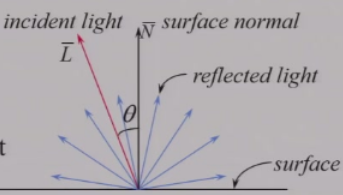
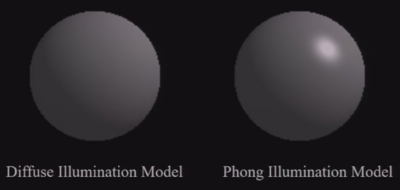
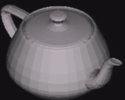
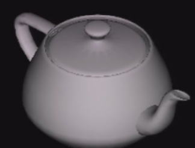
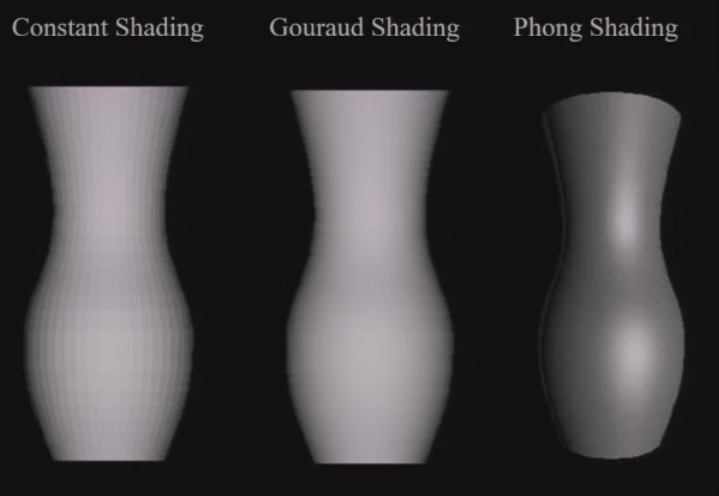

---	
comments : true	
---	
	
## 光影	
	
物体上看到光的渐变效果	
	
### 1. 局部光照	
	
#### 光照向量	
- 镜面反射 Phong Illumination Model	
- 漫反射   $I_d = k_d * I_p * max(0, N \cdot L)$	
- 环境光照   $I_a = k_a * I_p$	
	
### 2. 反射模型	
	
#### 漫反射	
向各个方向反射且光照强度一致	
	
	
$I_d = k_d * I_p * max(0, N \cdot L)$	
	
***环境光照***:  $I_a = k_a * I_p$	
### 3. Phong模型	
在环境光和漫反射的基础上，增加了一个镜面反射项。	
	
#### 镜面反射	
😠找到一个和角度有衰减的函数，来描述镜面反射的强度。	
	
- 衰减的速度快 -> 加上 $(cos\theta)^n$	
	
$I_s = k_s * I_p * max(0, R \cdot V)^n$	
	
与漫反射模型对比：	
	
	
	
### 4. 多光源	
	
一个累加堆积的过程	
$I = I_a k_a + \sum_{i=1}^{m} I_{p_i} \left[ k_d (\hat{N} \cdot \hat{L}_i) + k_s (\hat{R} \cdot \hat{V})^n \right]$	
	
### 5. OPENGL 光源	
	
- **Ambient 光源**：环境光源，均匀照亮场景中的所有物体。	
- **Point 光源**：点光源，发出光线从一个点向所有方向照射。	
- **Spot 光源**：聚光灯，发出光线从一个点向特定方向照射，形成一个锥形光束.	
	
	
	
## 阴影 shadow	
	
### 色调模型	
#### 1. constant shading	
每个面一个颜色，边界明显，适合低多边形模型	
	
	
	
#### 2. Gouraud shading	
每个顶点一个颜色，面内颜色通过插值计算，边界较平滑，适合高多边形模型	
	
	
	
#### 3. Phong shading	
计算顶点颜色，使用法线插值 -> 代入Phong模型计算	
	
	
	
可以看到 Phong shading 可以渲染出镜面反射