---	
comments : true	
---	
	
# 实体建模 (Solid Modelling)	
	
实体建模是 CAD/CAM/CAE 的核心基础，用计算机完整表示三维物体的几何形状、体积和拓扑结构。与线框模型不同，实体模型能够回答「这个点在物体内部还是外部？」这类根本性问题。	
	
!!! tip "核心要点"	
    三类主要方案：**分解表示**（Octree / Spatial Enumeration）→ 离散化空间；**构造表示**（CSG / Sweep）→ 组合生成；**边界表示**（B-Rep）→ 精确描述边界。工业 CAD 以 B-Rep 为主，CSG 常用于快速原型。	
	
---	
	
## 1. 线框模型的致命缺陷	
	
线框模型（Wireframe Model）是最早的三维表示方式，仅存储物体的**边**（点、直线、曲线）。	
	
**例子**：一个立方体在线框模型中只有 12 条边，没有面的概念。	
	
### 线框模型无法完成的 6 类任务	
	
| 任务 | 为什么做不到 |	
|------|------------|	
| **质量/体积计算** | 不知道哪些空间被占据 → 无法算重量 |	
| **消隐线/面生成** | 不知道哪个面在前 → 无法正确消影 |	
| **着色渲染** | 没有面的概念 → 无法 Phong/Gouraud 着色 |	
| **干涉与间隙分析** | 无法判断两物体是否碰撞/嵌入 |	
| **NC 加工路径** | 不知道材料在哪里 → 无法生成刀具路径 |	
| **有限元网格** | 没有体积信息 → 无法剖分网格 |	
	
### Nonsense Objects（无意义物体）	
	
线框模型可以表示出在实际三维空间中**不可能存在**的物体。	
	
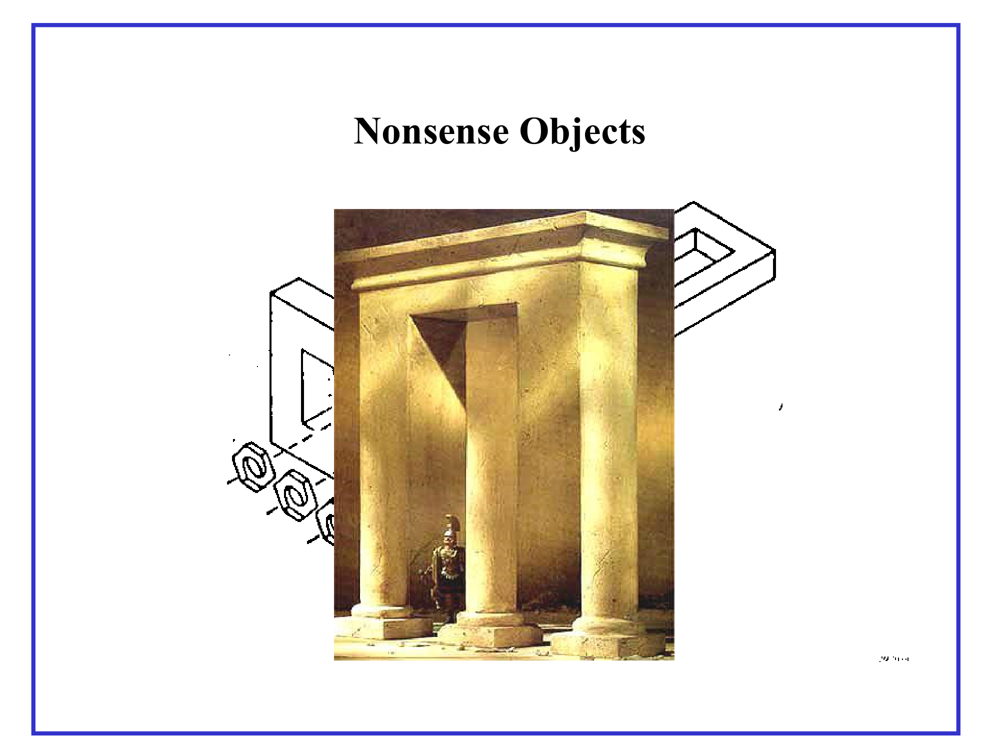	
	
经典例子：图中有两个立方体，线框表示完全相同（都是 12 条边），但一个是有体积的方块，另一个是"凭空悬浮"的线框。线框模型**无法区分**这两者。	
	
:arrow_right: 这就引出了实体建模的核心问题：**如何形式化地定义"有效实体"？**	
	
---	
	
## 2. 什么东西才算「实体」？	
	
一个有效的实体对象必须同时满足以下 6 条：	
	
!!! danger "考试重点"	
    6 条实体判定条件必须记住：Finite、3D、Rigid、Closure、Describable、Boundary。	
	
### 六大条件详解	
	
| 条件 | 解释 | 反例 |	
|------|------|------|	
| **有限（Finite）** | 占据有限空间，不能无限延伸 | 一根无限长的圆柱不是实体 |	
| **均匀三维（Homogeneously 3D）** | 在任何点都有体积，不能有"纸片" | 一个 zero-thickness 的面不是实体 |	
| **刚性（Rigid）** | 形状不变（在表示层面） | 定义上的要求，并非模拟要求 |	
| **封闭性（Closure）** | 刚性运动和布尔运算后仍是实体 | 两个球差集后必须是有效实体 |	
| **有限可描述（Finitely Describable）** | 用有限数据就能表示 | 分形表面无法有限描述 |	
| **边界可确定（Determinable Boundary）** | 能明确区分内部和外部 | 非流形物体不行 |	
	
### 问题物体（Questionable Objects）	
	
下图展示了两类不满足实体条件的物体：	
	
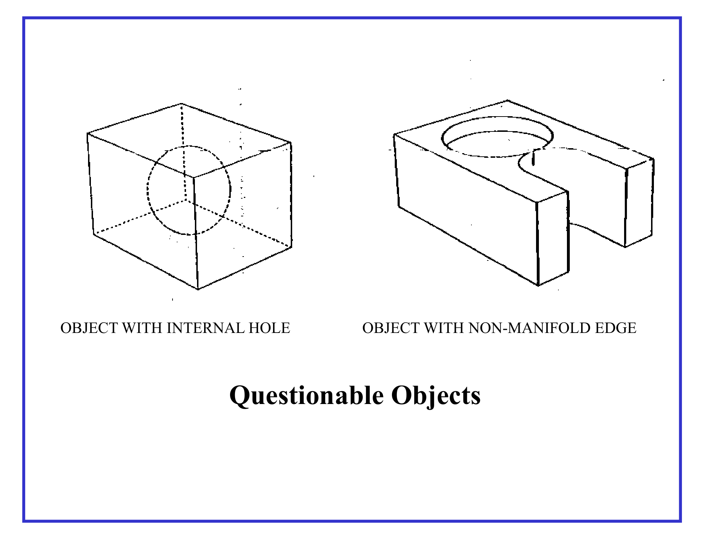	
	
- **左图（Internal Hole）**：物体内部有封闭空腔 → 边界可判定，但需要区分外边界和内边界	
- **右图（Non-Manifold Edge）**：一条边被三个面共享 → 存在点其邻域不等于一个圆盘 → 不是 2-Manifold	
	
**Manifold（流形）概念**：物体上任意点的无穷小邻域，在拓扑上等价于二维平面上的一个圆盘。如果某条边被三个或以上的面共享，该边上的点的邻域就是"三岔"而非圆盘，称为**非流形边（Non-Manifold Edge）**。	
	
---	
	
## 3. 三大表示方案总览	
	
| | 分解表示 | 构造表示 | 边界表示 |	
|--|----------|----------|----------|	
| 核心思想 | 将空间划分为体素 | 用基本操作生成实体 | 描述物体的表面边界 |	
| 代表方法 | Octree、Spatial Enum | CSG、Sweep、Primitive Inst | B-Rep、Polyhedron |	
| 精度 | 近似 | 精确（基元级） | 精确（几何级） |	
| 工业应用 | 有限元/医学影像 | 早期 CAD | 现代 CAD（CATIA/SolidWorks） |	
	
---	
	
## 一、分解表示（Decomposition）	
	
### 4.1 空间占有枚举（Spatial Occupancy Enumeration）	
	
**思想**：将三维空间划分为均匀立方体网格（Voxel），每个体素标记为 0（空）或 1（占）。	
	
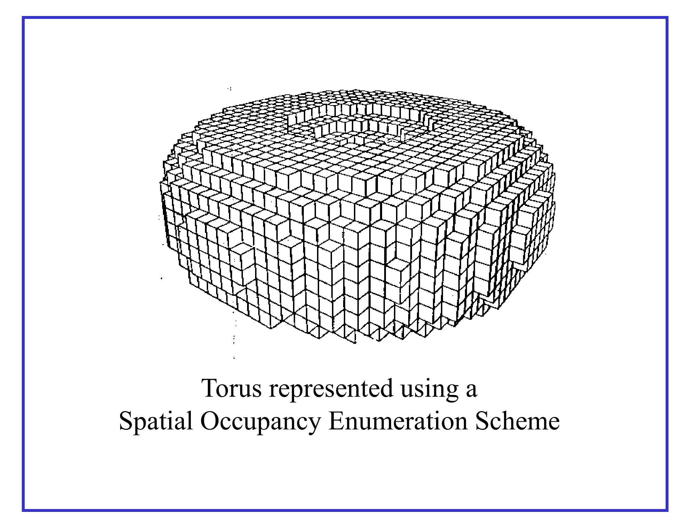	
	
上图展示了环面（Torus）的空间枚举表示。可以看到，即使是光滑曲面，也只能用阶梯状体素近似。	
	
**例子**：一个 100×100×100 的网格表示一个球体。球内部的体素为 1，外部为 0。球的体积 ≈ 标记为 1 的体素数 × 单个体素体积。	
	
**性质**：	
- ✅ 唯一且无歧义 —— 每个物体只有一种枚举结果	
- ✅ 不需要有效性检查 —— 任何 0/1 组合都对应某个物体	
- ✅ 布尔运算极简单 —— 逐体素 AND/OR/NOT	
- ❌ 存储需求 = $O(n^3)$（分辨率 $n$ 时需 $n^3$ 个体素）	
- ❌ 精度由分辨率决定，无法精确表示曲面法向	
	
### 4.2 空间划分方案	
	
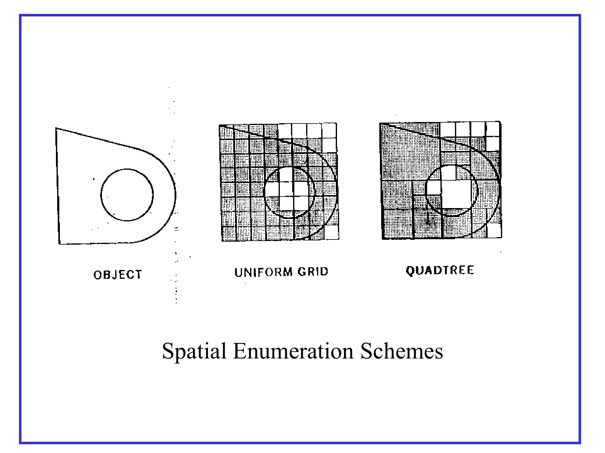	
	
上图对比了多种空间划分策略：	
- **均匀网格**：所有体素大小相同，浪费严重	
- **层次划分**：大块全空/全满不再细分 → 大幅压缩	
	
### 4.3 四叉树（Quadtree）— 二维先行	
	
四叉树是八叉树的二维版本，每层四等分矩形。下图展示了四叉树的数据结构：	
	
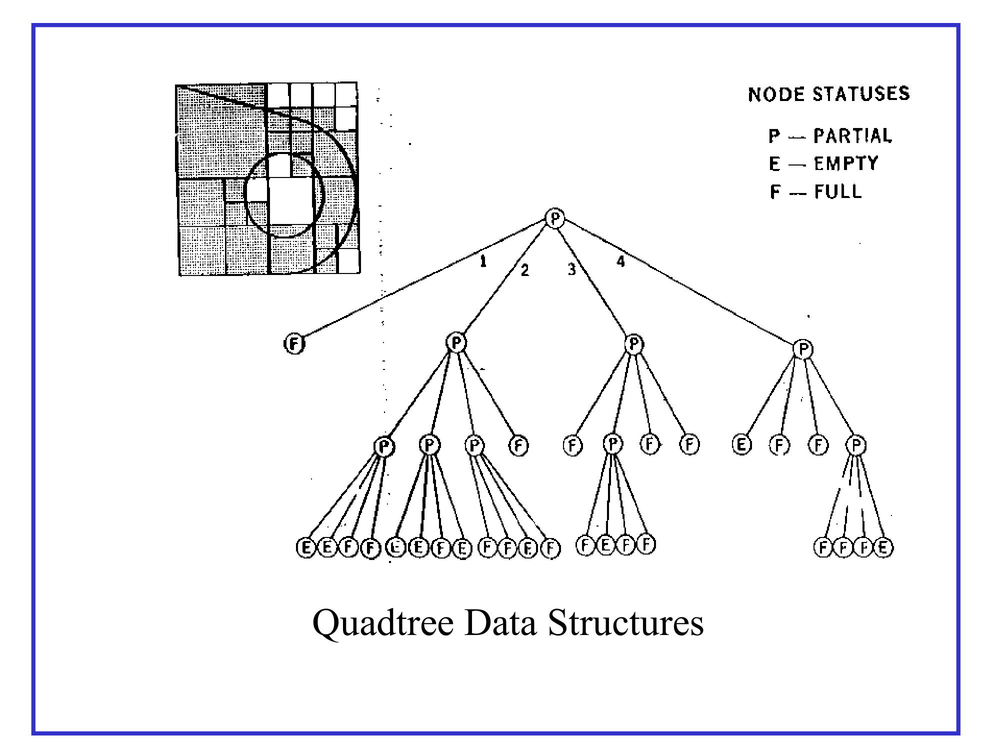	
	
**例子**：一个 8×8 的网格表示一个 L 形区域。左上角 4×4 全白 → 一个节点标记为 Empty。右下角 4×4 全黑 → 一个节点标记为 Full。其余区域继续四等分。	
	
### 4.4 八叉树（Octree）— 三维推广	
	
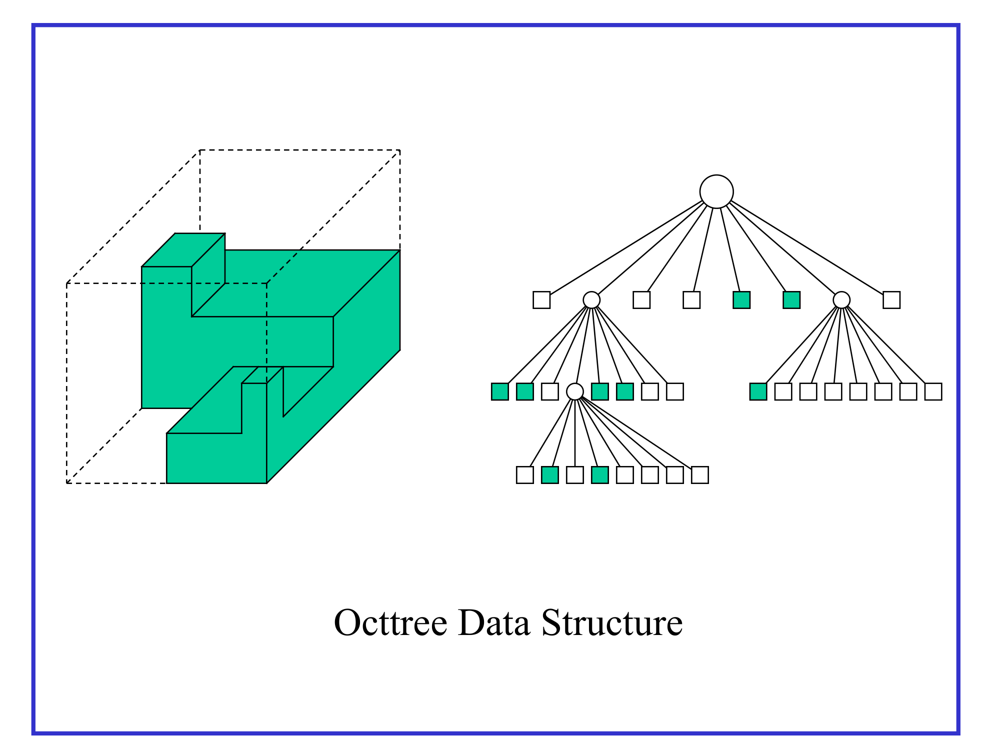	
	
**递归规则**：	
	
```text	
对每个立方体节点：	
  if 完全在物体内部 → 标记为 Full（黑）	
  elif 完全在物体外部 → 标记为 Empty（白）	
  else → 一分为八，递归处理 8 个子节点	
```	
	
**性质**：	
	
| 性质 | 说明 |	
|------|------|	
| 存储 | 远小于均匀枚举（全满/全空不细分） |	
| 精度 | 近似，分辨率由递归深度决定 |	
| 唯一性 | ✅ 唯一无歧义 |	
| 节点数 | 与物体**表面积**成正比 |	
| 布尔运算 | 从根向叶并行遍历两棵树逐节点运算 |	
	
**例子**：一个球的八叉树表示。完全在球内部的中心大块标记为 Full。完全在球外部的角落块标记为 Empty。只有跨越球面的块才递归细分。最深层级的节点决定了球的表面精度。	
	
**布尔运算示例**（八叉树 A ∪ 八叉树 B）：	
```text	
Union(nodeA, nodeB):	
    if nodeA == Full OR nodeB == Full → Full	
    elif nodeA == Empty → nodeB	
    elif nodeB == Empty → nodeA	
    else → 递归 Union 8 个子节点	
```	
$O(\text{节点数})$ 复杂度，非常高效。	
	
---	
	
## 二、构造表示（Constructive Representations）	
	
### 5.1 基元实例化（Primitive Instancing）	
	
**思想**：定义一组参数化的三维基元族，通过改变参数产生不同实例。	
	
**例子 — 齿轮基元**：	
```text	
Gear(module=2.0, teeth=20, thickness=10mm, bore=8mm)	
Gear(module=2.0, teeth=30, thickness=15mm, bore=10mm)	
```	
两行参数定义了两个不同的齿轮实体。	
	
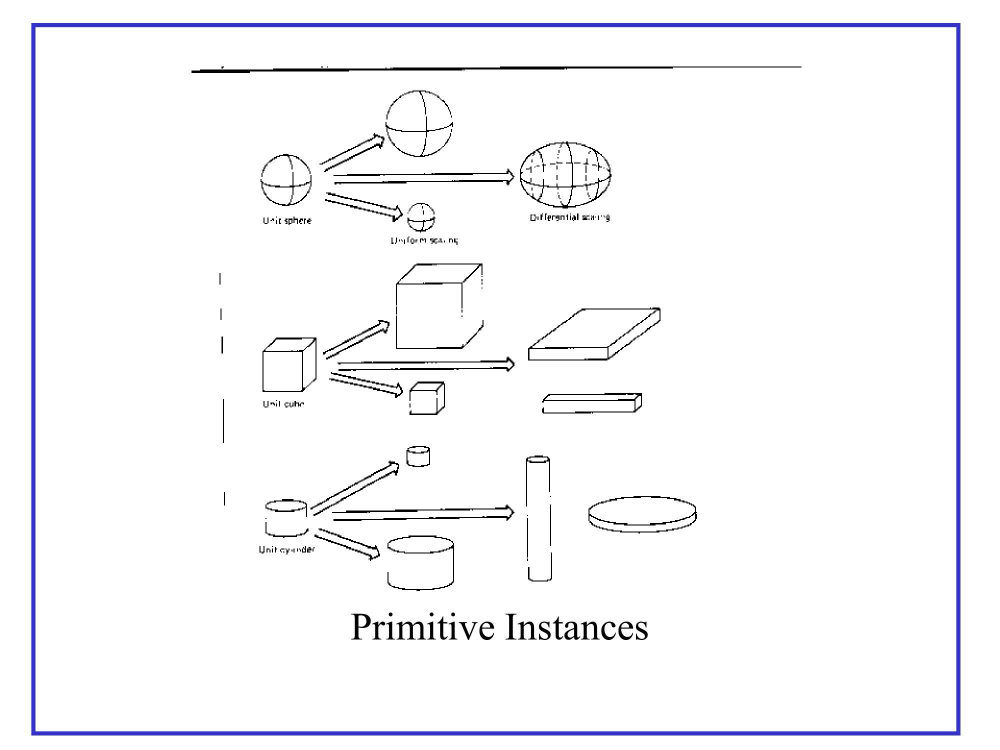	
	
**特点**：	
- ✅ 适合标准化零件库（齿轮、螺栓、轴承）	
- ✅ 参数化不仅是尺寸变换，还有结构特征（齿数、模数）	
- ❌ **不支持基元间的组合** —— 无法将基元和螺栓组装	
	
!!! warning "与 CSG 的区别"	
    基元实例化中，每个基元是独立的对象，**没有** Union/Intersection/Difference 等布尔运算能力。CSG 通过布尔运算组合基元。	
	
### 5.2 扫掠表示（Sweep Representation）	
	
**思想**：将二维截面沿路径移动，其轨迹生成三维实体。	
	
#### 平移扫掠（Extrusion）— 最常用	
	
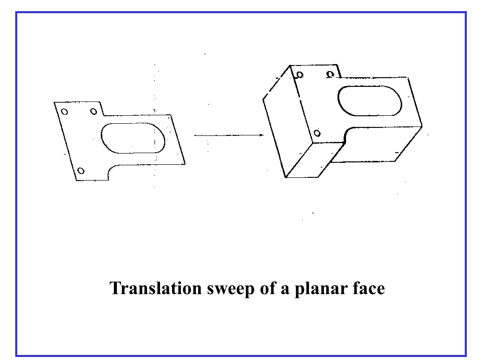	
	
**例子**：	
	
- **工字钢截面**沿直线方向拉伸 → 工字钢梁	
- **圆形截面**拉伸 → 圆柱体	
- **任意多边形截面**拉伸 → 棱柱	
	
数学表达：$Sweep(P, \vec{d}, L)$ = 将平面图形 $P$ 沿方向 $\vec{d}$ 移动距离 $L$。	
	
#### 旋转扫掠（Revolve）	
	
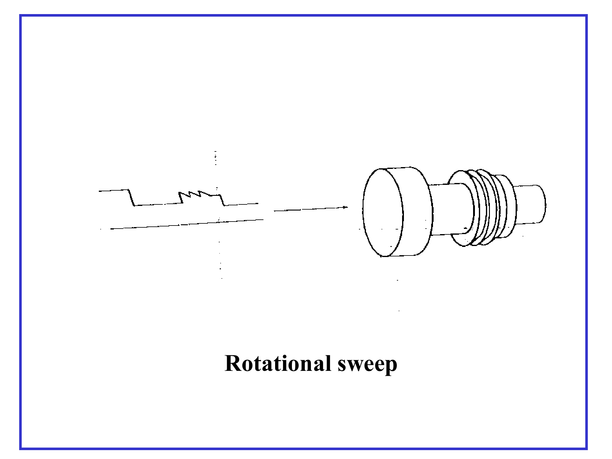	
	
**例子**：	
	
- **半圆绕直径旋转** → 球体	
- **矩形绕一边旋转** → 圆柱体	
- **花瓶截面轮廓**绕中心轴旋转 → 花瓶	
	
数学表达：$Sweep(C, axis, \theta)$ = 将曲线 $C$ 绕轴旋转角度 $\theta$，通常 $\theta = 360^\circ$。	
	
#### 放样（Lofting）	
	
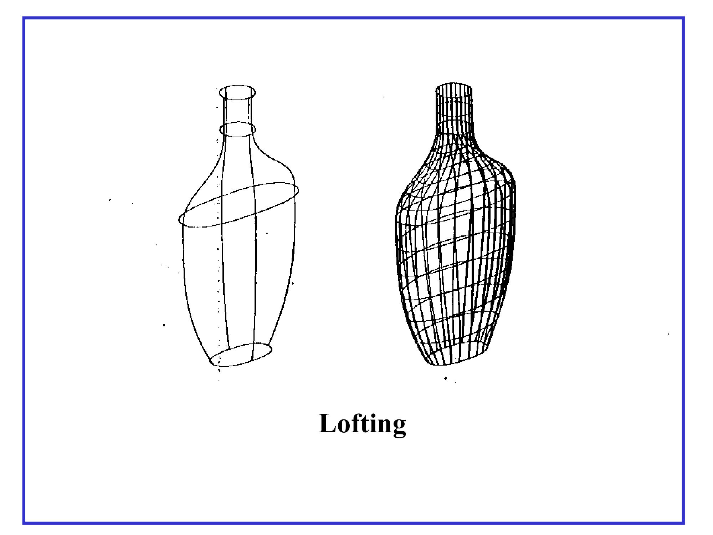	
	
**例子 — 船体建模**：	
```text	
截面 1（船头）: 尖锐三角形轮廓	
截面 2（船中）: 宽 U 形轮廓	
截面 3（船尾）: 中等矩形轮廓	
→ Loft 将这些截面光滑连接 → 完整船体	
```	
	
#### 参数化扫掠	
	
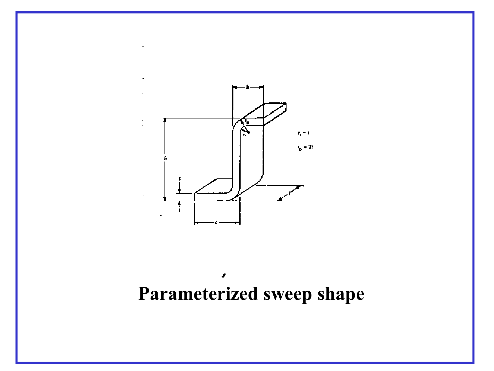	
	
沿路径移动时，截面不仅可以平移旋转，还可以**缩放**和**扭转**。	
**例子**：弹簧 = 圆形截面沿螺旋线路径 + 旋转跟随。	
	
#### 扫掠的陷阱 — 无效实体	
	
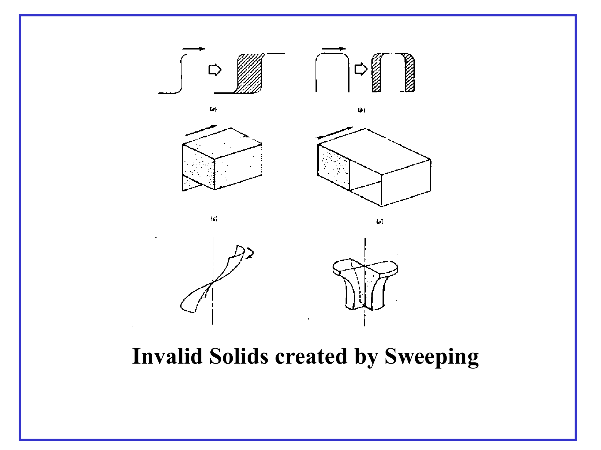	
	
**问题案例**：	
- 截面过大 + 路径曲率过大 → **自交**（物体穿透自己）	
- 平移扫掠方向平行于截面法向 → 产生**退化体**（无体积的面）	
- 截面旋转时扭曲过度 → 产生非流形结构	
	
### 5.3 CSG（构造实体几何）— 布尔运算的威力	
	
**思想**：用正则布尔运算组合简单基元（球、圆柱、方块等），构建复杂实体。	
	
!!! tip "正则布尔运算是什么？"	
    普通布尔运算可能产生悬边、悬面、零体积结构。**正则化（Regularization）** = 取内部点的闭包：$A \otimes B = \text{closure}(\text{interior}(A \text{ op } B))$，自动消除这些异常。	
	
#### 三种基本布尔运算	
	
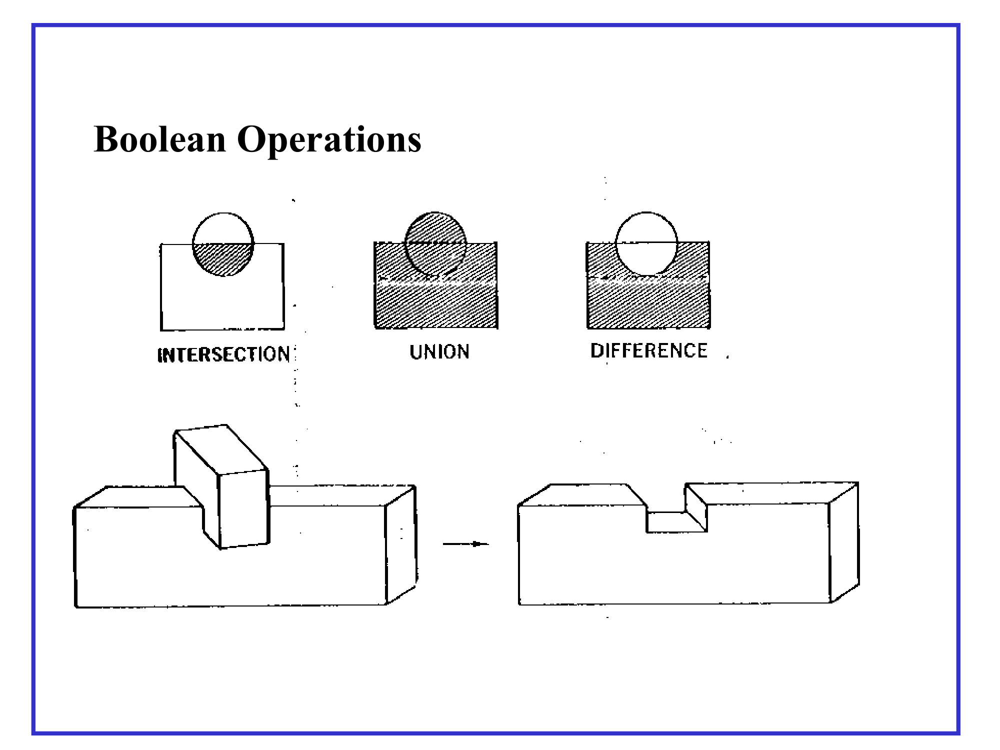	
	
| 运算 | 符号 | 含义 | 例子 |	
|------|------|------|------|	
| **并集（Union）** | $A \cup B$ | 两物体的全部空间 | 桌腿 ∪ 桌面 = 桌子 |	
| **交集（Intersection）** | $A \cap B$ | 两物体的公共空间 | 球 ∩ 立方体 = 圆角方块 |	
| **差集（Difference）** | $A - B$ | A 中去掉 B 的部分 | 方块 − 圆柱 = 带孔的方块 |	
	
**例子 — 用 CSG 造一个带孔的圆柱**：	
```text	
HollowCylinder = Cylinder(R=10, H=20) − Cylinder(R=5, H=20)	
```	
外圆柱差集内圆柱，得到一个空心管。	
	
**例子 — 造一个螺母**：	
```text	
Body = Cylinder(r=10, h=5)	
Hole = Cylinder(r=4, h=5)	
Body − Hole → 带孔的圆盘	
```	
然后再用六角棱柱做差集 → 六角形外轮廓。	
	
#### CSG 树	
	
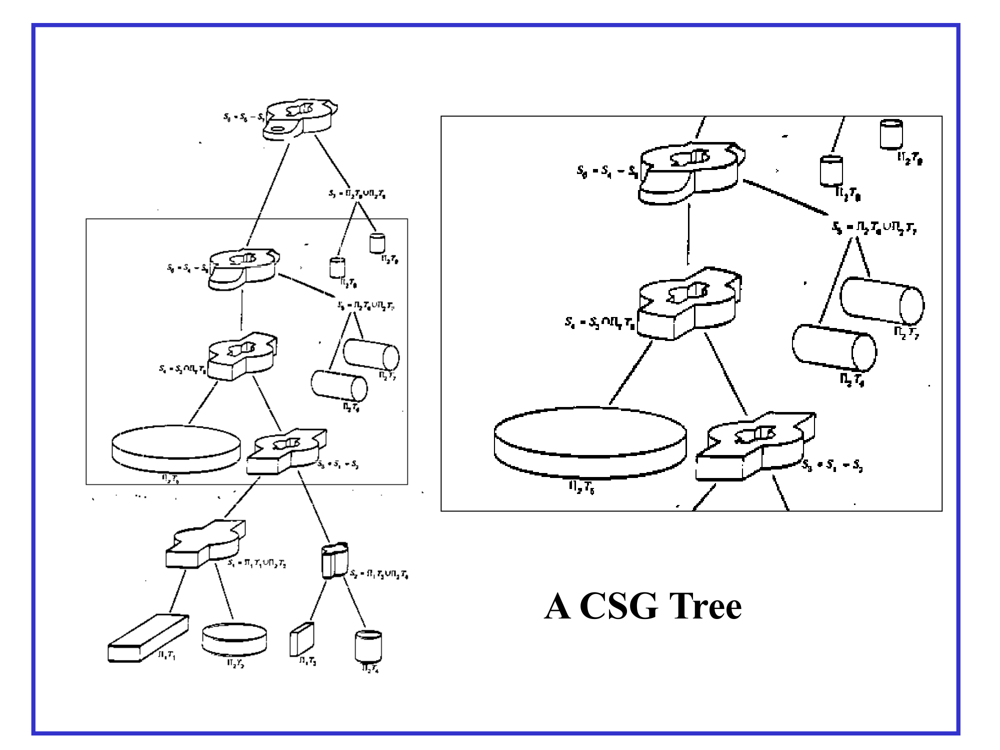	
	
```text	
                ∪ (Union)	
               /    \	
              ∩      B	
            /   \	
           A     C	
```	
	
- **内部节点**：布尔运算（∪, ∩, −）或几何变换（平移/旋转/缩放）	
- **叶节点**：基元（Block, Cylinder, Sphere, Cone, Torus, Wedge）	
- **树边有序**：区分左右子树（差集 A − B ≠ B − A）	
	
**性质总结**：	
	
| ✅ 优点 | ❌ 缺点 |	
|------|------|	
| 数据结构极简单（二叉树） | 局部操作困难（改螺母螺纹需重建树） |	
| 基元有效 → 结果始终有效 | 渲染需反复求交（Ray Casting） |	
| 历史记录完整，可回退编辑 | 不唯一（同一物体多种 CSG 树） |	
| 存储紧凑 | 无法直接访问边界信息 |	
	
---	
	
## 三、边界表示（B-Rep）	
	
边界表示是现代 CAD 软件（CATIA、SolidWorks、Nx）的核心表示方式。	
	
### 6.1 核心思想	
	
**不直接存储体积**，而是存储物体的**边界**（面、边、顶点）。通过边界隐式定义体积。	
	
**类比**：鸡蛋壳的形状定义了鸡蛋。如果蛋壳完整封闭，里面就是蛋黄。B-Rep 就是这个"蛋壳"。	
	
### 6.2 多面体与欧拉公式	
	
**多面体（Polyhedron）** = 由平面多边形围成的实体。每条边恰好被两个面共享，且可以遍历所有面而不"跳跃"。	
	
!!! danger "考试重点"	
    $V - E + F = 2$ 是必考公式。对任意简单多面体（可变形为球体）恒成立。	
	
**验证 — 正方体**：	
```text	
V = 8（顶点）	
E = 12（边）	
F = 6（面）	
V − E + F = 8 − 12 + 6 = 2 ✓	
```	
	
**验证 — 四棱锥（金字塔）**：	
```text	
V = 5（4 底顶点 + 1 顶顶点）	
E = 8（4 底边 + 4 斜边）	
F = 5（1 底面 + 4 侧面）	
V − E + F = 5 − 8 + 5 = 2 ✓	
```	
	
#### 广义欧拉公式	
	
真实零件常有孔洞和空腔：	
	
$$V - E + F - L = 2(S - G)$$	
	
| 符号 | 含义 | 例子 |	
|------|------|------|	
| $V$ | 顶点数 | — |	
| $E$ | 边数 | — |	
| $F$ | 面数 | — |	
| $L$ | 面上的内环数（Loop / Hole） | 每个通孔在每个面上产生一个环 |	
| $S$ | 独立的壳体数（Shell） | 一般来说为 1 |	
| $G$ | 贯穿孔数（Genus / 亏格） | 环面 $G=1$，球 $G=0$ |	
	
**例子 — 带一个通孔的方块**：	
```text	
可以想象为方块挖了一个圆柱洞。洞穿过了 2 个面 → 每个面上多了一条内环。	
假设：V=16, E=24, F=10, L=2（两个面上的孔环）, S=1, G=1	
验证：V − E + F − L = 16 − 24 + 10 − 2 = 0	
      2(S − G) = 2(1 − 1) = 0 ✓	
```	
	
**例子 — 环面（Torus / 甜甜圈）**：	
```text	
假设一个多边形化的环面：V=9, E=18, F=9, L=0, S=1, G=1	
验证：V − E + F − L = 9 − 18 + 9 − 0 = 0	
      2(1 − 1) = 0 ✓	
```	
	
### 6.3 Facetted Model（面片模型）	
	
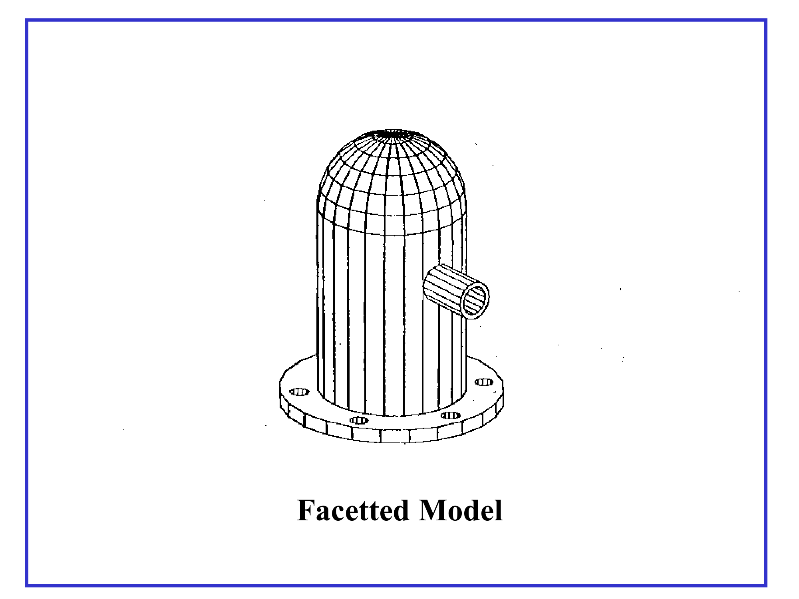	
	
曲面物体被近似为许多小平面的集合。三角形的密度决定了逼近精度。	
	
**例子**：一个球体用 1000 个三角形近似。三角形越多越接近真球，但数据量也越大。	
	
### 6.4 B-Rep 的数据组织	
	
B-Rep 存储**两类数据**：	
	
#### 几何数据（Geometric Data）	
	
物体的"坐标"——决定了物体的**形状**：	
- 顶点坐标 $(x, y, z)$	
- 曲线控制点（Bézier / NURBS）	
- 曲面控制网格参数	
	
#### 拓扑数据（Topological Data）	
	
组件的"连接关系"——决定了物体的**结构**：	
	
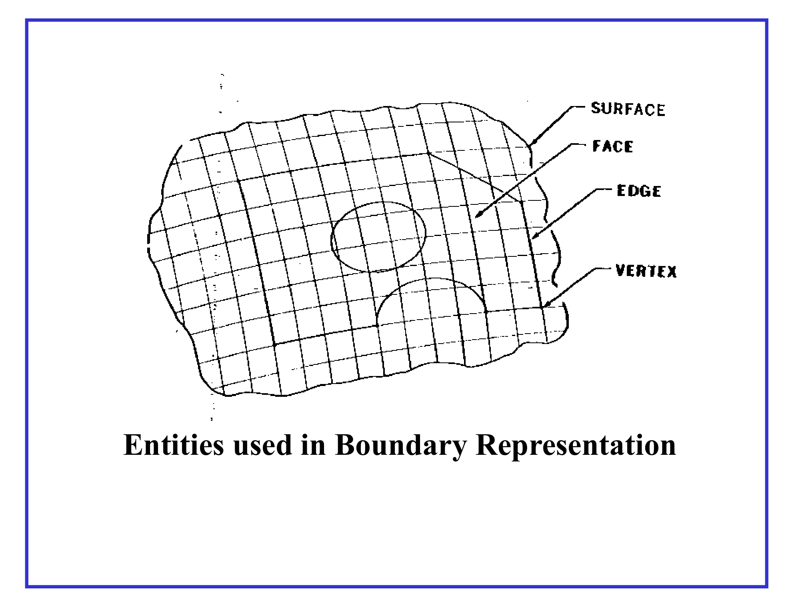	
	
层次结构：	
```text	
Solid（实体）	
 └── Shell（壳体）— 包围体积的封闭面集合	
      └── Face（面）— 边界上的一个面	
           └── Loop（环）— 面的边界（外环/内环）	
                └── Edge（边）— 两个面的交线	
                     └── Vertex（顶点）— 边的端点	
```	
	
**例子**：一个方块（6 个面）→ 每个面有 1 个外环（4 条边）→ 每条边 2 个端点。所有数据既有几何坐标又有拓扑关系。	
	
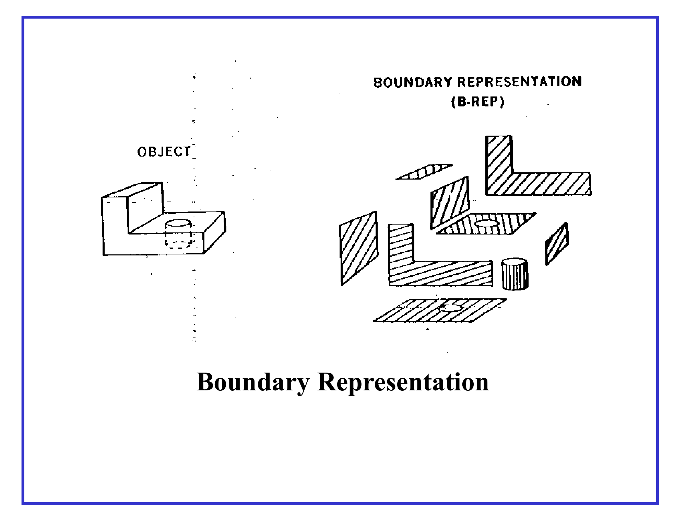	
	
!!! warning "几何 vs 拓扑"	
    几何确定「在哪里」，拓扑确定「谁连着谁」。同一拓扑可以对应不同几何（方块 vs 斜方块）。**修改几何不影响拓扑，修改拓扑必须重新验证**。	
	
### 6.5 欧拉算子（Euler Operators）	
	
B-Rep 模型的所有合法编辑操作可以归结为 5 个基本算子 + 它们的逆操作。	
	
| 算子 | 全称 | 功能 | 例子 |	
|------|------|------|------|	
| **MEV** | Make Edge and Vertex | 在已有边上加一个新顶点，创建新边 | 将一条边一分为二 |	
| **MFE** | Make Face and Edge | 连接两条已有边，创建一个新面 | 在长方体上切出一个斜面 |	
| **MBFV** | Make Body Face Vertex | 从零开始创建实体、面和顶点 | 创建第一个点 → 整个模型的起点 |	
| **MRB** | Make Ring Body | 创建内环（孔洞） | 在面上开一个孔 |	
| **ME-KH** | Make Edge, Kill Hole | 消除孔洞（连接内环） | 把面中间的内环用边连起来消除 |	
	
**关键性质**：任何合法的拓扑变换都可以用这 5 个基本操作的组合来实现。欧拉算子**保证**每次操作后欧拉公式始终成立 — 即保证拓扑有效性。	
	
**例子 — 用欧拉算子构建方块**：	
```text	
MBFV → 创建初始实体 + 第一个面 + 第一个顶点	
3 × MEV → 在同一面上创建另外 3 个顶点和 3 条边	
MFE → 连接第 4 条边，封闭第一个面	
继续 MEV + MFE → 构建其余 5 个面	
```	
这样 6 个面的方块就构建好了，且每个中间步骤都是有效实体。	
	
**例子 — 给方块钻孔**：	
```text	
MRB → 在顶面创建内环（孔的外边界）	
MEV × 4 → 在内环上创建顶点和边	
继续 MEV + MFE → 将孔延伸到对面	
MRB → 在底面创建内环	
ME-KH → 如果需要填充这个孔	
```	
每一步都保证 $V - E + F - L = 2(S - G)$ 成立。	
	
---	
	
## 四、表示方案深度对比	
	
| 维度 | 空间枚举 | 八叉树 | 基元实例化 | Sweep | CSG | B-Rep |	
|------|:--:|:--:|:--:|:--:|:--:|:--:|	
| **精度** | 近似 | 近似 | 精确 | 精确 | 精确 | 精确（曲面） |	
| **定义域** | 任意 | 任意 | 有限族 | 扫掠可达域 | 广 | 广 |	
| **唯一性** | ✅ | ✅ | 基元选好则✅ | 否 | 否 | 否 |	
| **有效性检查** | 无需 | 无需 | 定义保证 | 困难 | 局部检查 | 极困难 |	
| **布尔运算封闭** | ✅ | ✅ | ❌ | ❌ | ✅ | ✅ |	
| **局部操作** | 易 | 易 | — | — | 困难 | 易 |	
| **存储效率** | 低 | 中 | 高 | 高 | 高 | 中 |	
| **渲染速度** | 慢 | 中 | — | — | 需求交 | 快 |	
	
### 工业实践	
	
- **CAD 建模**（SolidWorks, CATIA）：B-Rep 为主 + CSG 历史树辅助	
- **医学影像 / 有限元**：八叉树 + 空间枚举（从 CT/MRI 直接生成）	
- **游戏引擎**：B-Rep 转三角面片（Facetted Model）	
- **3D 打印**：B-Rep → STL（三角面片）→ 切片 → G-Code	
	
!!! tip "总结"	
    没有"最好"的表示方案，只有最合适的。现代 CAD 系统通常**混合使用**多种方案：CSG 构建 + B-Rep 存储 + 三角面片渲染。