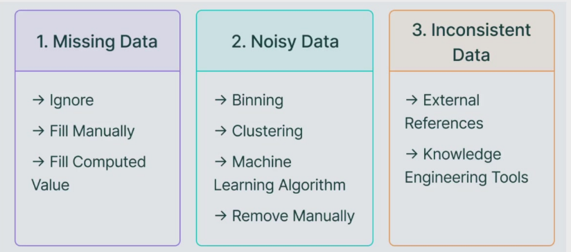
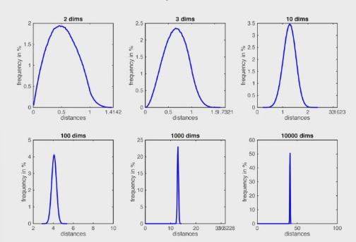

---	
comments : true	
---	
	
# 数据预处理	
	
!!! tip "核心要点"	
    数据预处理是数据挖掘的关键步骤。**缺失值**用填充/删除处理，**规范化**用 Min-Max/Z-Score，**降维**用 PCA。	
	
## 数据质量问题	
	
常见三类数据问题：	
	
- **数据缺失（Missing Data）**：某些属性值为空	
- **数据不一致（Inconsistency）**：同一数据在不同源中矛盾	
- **噪声数据（Noisy Data）**：包含错误或异常值	
	
	
	
## 缺失值处理	
	
| 方法 | 做法 | 优缺点 |	
|------|------|--------|	
| 删除 | 删掉缺失值所在行/列 | 简单，但损失信息 |	
| 均值/中位数填充 | 用该列均值或中位数填充 | 快速，但降低方差 |	
| 众数填充 | 用出现最多的值填充 | 适合分类属性 |	
| 回归/插值 | 用其他变量预测缺失值 | 较准确，计算成本高 |	
| KNN 填充 | 找相似样本的值填充 | 较准确，但计算量大 |	
	
## 数据规范化（Normalization）	
	
### Min-Max 归一化	
	
将数据映射到 $[0, 1]$：	
	
$$x' = \frac{x - x_{min}}{x_{max} - x_{min}}$$	
	
### Z-Score 标准化	
	
均值为 0，标准差为 1：	
	
$$x' = \frac{x - \mu}{\sigma}$$	
	
### Decimal Scaling（小数定标）	
	
$$x' = \frac{x}{10^j}$$	
	
其中 $j$ 是使 $\max(|x'|) < 1$ 的最小整数。	
	
!!! warning "常见误区"	
    KNN 和 SVM 对特征尺度敏感，必须做归一化。决策树和朴素贝叶斯对尺度不敏感，可以不做。	
	
## 数据集成	
	
将多个数据源整合为统一视图，消除冗余、提高一致性。	
	
### 相关性分析	
	
- **Pearson 相关系数**：$\rho = \frac{cov(X, Y)}{\sigma_X \sigma_Y}$（线性相关）	
- **$\chi^2$ 检验**：检验两个分类变量是否独立	
	
## 数据降维（Data Reduction）	
	
	
	
### 维度灾难（Curse of Dimensionality）	
	
维度增高 → 数据稀疏性增加 → 距离度量失效 → 模型过拟合。	
	
### 主要方法	
	
- **PCA（主成分分析）**：中心化 → 协方差矩阵 → 特征值分解 → 选前 k 个特征向量 → 投影	
- **Grid Indexing**：将数据空间划分为网格，减少数据维度	
- **归一化**：Min-Max / Z-Score 缩放到统一范围	
	
### 其他降维方法	
	
- **特征选择**：只保留重要特征，去掉冗余特征	
- **抽样**：随机抽样、分层抽样减少数据量	
- **离散化**：连续值 → 离散区间（等宽/等频分箱）