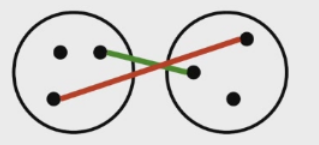
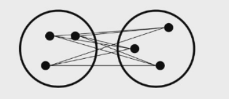

---	
comments : true	
---	
	
# 聚类	
	
聚类是一种无监督学习方法，将数据集划分为若干个簇，使同一簇内相似度高，不同簇间相似度低。	
	
!!! tip "核心要点"	
    K-means 最快但只能找球形簇。DBSCAN 能找任意形状且抗噪声。层次聚类不需要预知 K。EM 是软聚类。	
	
## 1. K-means 算法	
	
1. 初始化：随机选择 K 个点作为初始簇中心	
2. 分配：将每个点分配到最近的中心	
3. 更新：重新计算每个簇的均值作为新中心	
4. 停止：簇中心不再变化或达到最大迭代次数	
	
### 选择 K 值	
	
- **肘部法（Elbow Method）**：画 SSE 随 K 变化曲线，找"肘点"	
- **轮廓系数（Silhouette Score）**：$s = \frac{b - a}{\max(a, b)}$	
	
$$\text{SSE} = \sum_{i=1}^{K} \sum_{x \in C_i} \|x - \mu_i\|^2$$	
	
### 优缺点	
	
- ✅ 简单快速，$O(n \cdot K \cdot t)$	
- ❌ 需预先指定 K，对初始点敏感，只能找球形簇	
	
!!! warning "对初始值敏感"	
    K-means 不同初始中心会收敛到不同结果。实际中用 K-means++ 初始化来避免。	
	
## 2. DBSCAN（Density-Based Clustering）	
	
基于密度的聚类，能识别任意形状的簇，对噪声鲁棒。	
	
### 核心概念	
	
- **核心点（Core Point）**：$\epsilon$ 邻域内包含至少 minPts 个点	
- **边界点（Border Point）**：在核心点的 $\epsilon$ 邻域内但自身不满足核心条件	
- **噪声点（Noise Point）**：既不是核心点也不是边界点	
	
### 算法	
	
1. 选未访问点 p，计算其 $\epsilon$ 邻域	
2. 若为核心点 → 扩展簇（加入所有密度可达的点）	
3. 否则标记为噪声，继续检查下个点	
	
### 参数选择	
	
- $\epsilon$ 太小 → 很多点变噪声	
- $\epsilon$ 太大 → 所有点聚为一类	
- 建议用 K-distance 图找拐点	
	
## 3. 层次聚类	
	
1. 每个点作为一个簇	
2. 合并最近的两个簇	
3. 重复直到所有点在一个簇中	
	
### 簇间距离度量	
	
- **单链接（Single Link）**：最近距离 → 易产生链状	
- **全链接（Complete Link）**：最远距离 → 倾向圆球形	
- **平均链接（Average Link）**：平均距离 → 折中	
	
	
	
	
## 4. 聚类评估	
	
- **内部指标（Internal）**：不依赖外部标签，如轮廓系数、Davies-Bouldin 指数	
- **外部指标（External）**：与 ground truth 比较，如 Rand Index、NMI	
- **人工评估**：专家审查聚类结果	
	
## 5. 高级聚类场景	
	
### Soft Clustering	
	
每个点可以属于多个簇，附带隶属度权重。	
	
### 基于混合模型（Mixture Model）	
	
假设数据由 K 个高斯分布混合生成，用 EM 算法求解。	
	
#### EM 算法	
	
1. **E-Step**：根据当前参数，计算每个点属于每个分布的概率	
2. **M-Step**：根据概率重新估计分布参数（均值、协方差）	
3. 重复直到收敛	
	
### Spectral Clustering（谱聚类）	
	
基于图论：构建相似度矩阵 → 计算拉普拉斯矩阵 → 特征值分解 → 对特征向量做 K-means。适合非线性可分数据。