# 机器学习

##  第一章 

定义: 利用经验改善系统自身性能

---
## 第二章
<h2 style="color: #2931d9ff; font-weight: normal;"> 基本术语和模型评估</h2>

#### 基本术语和概念学习

- ***1.经典的机器学习过程***：

- ***2.术语拓展：***
    
    - **数据**：

        |基本术语|解释|
        |-------|----|
        |特征   |又称属性，$\bold{x} = (x_0,x_1,\cdots,x_{n-1}), x_i\in\Sigma_i$|
        |属性值|特征的离散取值或连续取值|
        |样本维度|特征的个数,即$n$|
        |特征张成的空间|属性空间/特征空间/输⼊空间|
        |标记张成的空间|标记空间/输出空间|
        |示例/样本|一个对象的输入，示例不含标记|
        |样例|示例+标记|
    - **任务**：
    根据标记的取值情况分为：

        | 任务  |  标记情况 |
        |---|----|
        |分类|离散值|
        |回归|连续值|
        |聚类|空值  |
        |监督学习|所有示例都有标记|
        |无监督学习|所有示例都没有标记(聚类)|

    - **目标**：
    泛化能力(对未来的预测能力)

- ***3.概念学习***

   - **假设空间**:枚举所有的假设，样本 $\bold{x} = (x_0,\cdots,x_{n-1}) \in \bold{V}$ , $H = \{ h | h \subset \bold{V}\}$，也就是对 $\bold{x}$ 所有取值的预测函数，包括 $\empty$.
   - **版本空间**：假设空间的子集，在训练集上全部运行正确,如：$h_{色泽 = *,根蒂 = *,敲声 = 浊响}(\bold{x}),$对于所有的样本$\bold{x}$都能预测正确，那么该$h$属于版本空间。
   - **归纳偏好**：对非测试集不同预测可能会有不同的结果。
   - **没有免费午餐**：一个算法$\xi_a$如果在某些问题上比另一个算法$\xi_b$好，必然存在另一些问题，$\xi_b$比$\xi_a$ 好, 也即没有免费的午餐定理。(总误差与学习算法无关)
- ***4.模型评估与选择***

    **4.1 选择模型**：经验性能$E$(历史表现) $\approx$ 泛化性能$E^*$(未来表现得不到)

    - **经验误差**：也称训练误差，在训练集上的误差
    - **过拟合**：将样本本身特点当做一般性质学习$\to$ 优化目标加正则项
    - **欠拟合**：对样本的一般性质没有学好$\to$ 决策树：拓展分支，神经网络：增加训练轮数

    **4.2 评估方法**：

    | 方法 |解释|
    |----|---|
    |留出法|将数据划分两个互斥集合训练和测试集，保持数据分布一致性和类别比例一致性$2:1 \sim 4:1$|
    |交叉验证法||
    |自助法|从$D$中随机有放回取生成$D'$  |
    |调参数|对算法的参数进行设定，在验证集上确定参数。训练集：模型训练，验证集：参数调优，测试集：最终评估 |

    **4.3 性能度量**：
    ***4.3.1 "混淆矩阵"***:

    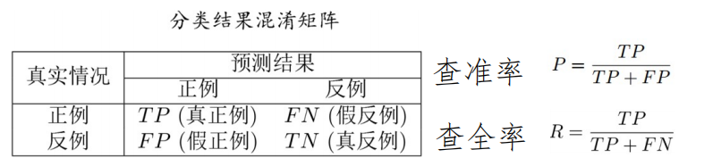

    查准率$P$：所有模型预测的正例中真正正例所占的比例。

    查全率$R$：所有的正例中模型预测为正例的比例。

    ***4.3.2 P-R曲线***：
    

    平衡点：查准率= 查全率时的取值，用来度量曲线有交叉的两个分类器的性能，如图中A，B。
    ***4.3.3 $F_1$度量***:

    $F_1 = \frac{2 \times P \times R}{P + R}$

    更一般的形式$F_{\beta}$：

    $F_{\beta} = \frac{(1 + \beta^2)\times P \times R}{(\beta^2 \times P) + R}$

    |$\beta$ | 作用   |
    |--------|---|
    |$\beta = 1$|标准$F_1$|
    |$\beta > 1$|偏重查全率(逃犯信息检索)|
    |$\beta < 1$|偏重查准率(商品推荐系统)|

    ***4.3.4 ROC曲线***:

    真正例率：$\frac{TP}{TP + FN}$,预测正例中正例占所有正例的比例.

    假正例率：$\frac{FP}{FP + TN}$，预测正例中徦例占所有徦例的比例.

    
    ***面积大者优，也称 AUC值***

    AUC衡量了样本预测的排序质量

    ***4.3.5 性能评估***:

---
## 第三章
<h2 style="color: #2931d9ff; font-weight: normal;"> 线性模型</h2>

#### 1.基本形式

$f(\bm{x}) = w_1 x_1 + w_2 x_2 + \cdots + w_d x_d +b$

向量形式：

$f(\bm{x}) = \bm{w^T}\bm{x} + b$

#### 2.回归任务

单元目标：$f(x) = w x_i + b$,使得：$f(x_i) \simeq y_i$

最小化均方误差：$E_{(w,b)} = \sum\limits_{i =1}^{m}(y_i - w x_i- b)^2$

**多元线性回归：**
$f(\bm{x_i}) = \bm{w}^T\bm{x_i} + b$， 数据有多个属性

数据集 $D = \{(\bm{x_1},y_1),(\bm{x_2},y_2),\cdots,(\bm{x_m},y_m)\}$

其中 $\bm{x_i} = (x_{i1},x_{i2},\cdots,x_{id}),y_i \in \mathbb{R}$ 

令 $\bold{X} = \begin{pmatrix}
x_{11} & x_{12} & \cdots& x_{1d} &1 \\
x_{21} & x_{22} & \cdots& x_{2d} & 1\\
\cdots    & \cdots    &\cdots&\cdots. & \cdots\\
x_{m1} &x_{m2} & \cdots& x_{md} & 1
\end{pmatrix}$ $= 
\begin{pmatrix}
\bm{x}_1^T & 1\\
\bm{x}_2^T & 1\\
\cdots &\cdots\\
\bm{x}_m^T & 1
\end{pmatrix}$

$\hat{\bm{w}} = (\bm{w} ; b)$,则：

$\bold{f(\bold{X})} = \bold{X} \hat{\bm{w}}$ ，损失函数 $E_{\hat{\bm{w}}} = (\bm{y} - \bold{X}\bm{\hat{w}})^T(\bm{y} - \bold{X}\bm{\hat{w}})$

一阶导： $\frac{\partial E_{\bm{\hat{w}}}}{\partial \bm{\hat{w}}} = 2 \bold{X} ^T (\bold{X}\bm{\hat{w}} - \bm{y})$.

#### 3.二分类任务

$z = \bm{w}^T\bm{x} + b$

$y = g(z)$,根据$z$的值来进行分类

单位阶跃函数：

$$y=
\begin{cases}
0, & \textbf{z < 0}\\
0.5, &\textbf{z = 0}\\
1, &\textbf{z > 0}
\end{cases}$$

替代函数：$y = \frac{1}{1 + e^{-z}} = \frac{1}{1 + e^{-(\bm{w}^T\bm{x} + b)} }$

   
**对数几率**：事件发生的概率比上不发生的概率的对数，即：

$\ln \frac{p(y=1|\bm{x})}{p(y=0|\bm{x})} = \ln\frac{p(y = 1|\bm{x})}{1-p(y = 1|\bm{x})} = \bm{w}^T\bm{x} +b$

#### 4.多分类任务

#### 5.类别不平衡

即 $\frac{y}{1-y} > 1$

将其转化为类别平衡任务

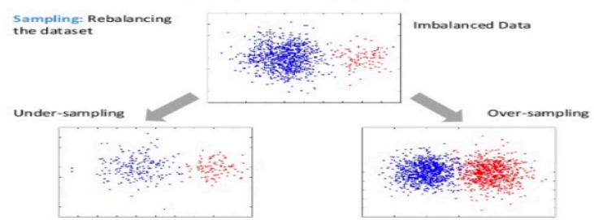

---
## 第四章
<h2 style="color: #2931d9ff; font-weight: normal;"> 决策树</h2>

#### 1.基本流程：基于树结构来进行预测
递归停止条件：

1. 当前节点包含的样本全都属于同一类，全为好瓜或者坏瓜 

2. 当前属性集为空，或者所有样本在所有属性上取值相同，即剩下的分类属性没区别，样本的“纹理”都=“清晰”，“脐部”都=“凹陷”

3. 当前结点包含的样本集合为空，看其父节点数量最多的类别，好瓜多则该属性下分类标记为好瓜

#### 2.划分选择

##### 2.1 概念
***信息熵：***  $Ent(D) = - \sum\limits_{k=1}^{\mathcal{Y}}p_k\log_2p_k$
值越小纯度越高，我们希望信息更纯，所以需要最大化减小信息熵

***信息增益：*** $Gain(D,a) = Ent(D) - \sum\limits_{v=1}^{V} \frac{|D^v|}{|D|}Ent(D^v)$ 
对于属性 $a$ 划分产生 $V$ 个结点 $Ent(D^v)$ 为每个结点的信息熵

***选择：*** 每次选择信息增益最大的属性划分

***缺点：*** 信息增益指标很明显偏好取值数目多的属性，也就是 $V$ 值越大信息增益会偏大

##### 2.2 $C4.5$决策树算法 
于是可以考虑规范化，使用"增益率 " $Gain\_ratio(D,a) = \frac{Gain(D,a)}{IV(a)}$ , 其中 $IV(a) = -\sum\limits_{v=1}^{V}\frac{|D^v|}{|D|}\log_2\frac{|D^v|}{|D|}$ 

##### 2.3 $CART$决策树

**基尼指数:** $Gini(D) = \sum\limits_{k=1}^{|\mathcal{Y}|}\sum\limits_{k'\neq k}^{}p_kp_{k'} = 1- \sum\limits_{k=1}^{|\mathcal{Y}|}p_k^2$
反映了从数据集中随机取两个样本，其类别标记不一致的概率，指数越小越纯

**关于属性$a$的基尼指数定义：**$Gini\_index(D,a) = \sum\limits_{v=1}^{V}\frac{|D^v|}{|D|}Gini(D^v)$

#### 3.剪枝处理
为什么剪枝？ 

- [x] 处理决策树过拟合 

用留出法预留一部分数据作为"验证集"进行性能评估

##### 3.1 预剪枝
1. 针对<u>训练集</u>，根据信息增益准则选择属性进行划分
2. 用<u>验证集</u>计算划分前后精度变化
3. 若提高精度，则划分

##### 3.2 后剪枝
先建树后根据剪枝前后验证集精度决定是否剪除

#### 4.连续值与缺失值

##### 4.1 连续值下的处理

- [x] 二分法
- [x] 离散化

1.考虑连续属性a在样本集上的n个不同取值，从小到大排列 $a^1,a^2,\cdots,a^n$,基于划分点$t$ 可以分为子集$D_t^+,D_t^-$.划分点集合 $T_a = \{ \frac{a^i+a^{i+1}}{2}|1 \leq i \leq n-1\}$,即相邻点的中值集合.

2.考察划分点，选最优：
$Gain(D,a) = \max\limits_{t \in T_a}Gain(D,a,t) = \max\limits_{t\in T_a}Ent(D) - \sum\limits_{\lambda \in \{-,+\}}\frac{|D_t^{\lambda|}}{|D|}Ent(D_t^{\lambda})$

 该属性还可以作为后代结点的划分属性🧐

##### 4.2 缺失值处理

令 $\tilde{D}$ 表示 $D$ 在属性 $a$ 上没有缺失的样.
假设属性 $a$ 有 $V$ 个取值 $\{a^1,a^2,\cdots,a^V\}$.
$\tilde{D}^v$ 表示 $\tilde{D}$ 中属性 $a$ 取值为 $a^v$ 的样本子集.
$\tilde{D}_k$ 表示 $\tilde{D}$ 中属于第 $k$ 类 $(k = 1,2,\cdots, |\mathcal{Y}|)$ 的样本子集.
假设对每个样本 $\bm{x}$ 赋予一个权重 $w_{\bm{x}}$ ,定义：
-   无缺失值样本所占比例： $\rho = \frac{\sum\limits_{\bm{x}\in \tilde{D}}w_{\bm{x}}}{\sum\limits_{\bm{x}\in D}w_{\bm{x}}}$
-   无缺失值样本中第 $k$ 类所占比例：$\tilde{p}_k = \frac{\sum\limits_{\bm{x}\in\tilde{D}_k}w_{\bm{x}}}{\sum\limits_{\bm{x}\in \tilde{D}}w_{\bm{x}}}$
-   无缺失值样本属性 $a$ 上取值 $a^v$ 比例：$\tilde{r}_v = \frac{\sum\limits_{\bm{x}\in \tilde{D}^v}w_{\bm{x}}}{\sum\limits_{\bm{x}\in\tilde{D}}w_{\bm{x}}}$

信息增益推广计算式：

$$
Gain(D,a) = \rho \times Gain(\tilde{D},a) = \rho \times \Bigg(Ent(\tilde{D}) - \sum\limits_{v=1}^{V}\tilde{r}_vEnt(\tilde{D}^v) \Bigg)
$$

其中 $Ent(\tilde{D}) = - \sum\limits_{k=1}^{|\mathcal{Y}|} \tilde{p}_k\log_2\tilde{p}_k$.

❇️ 对于属性 $a$  未知的 $\bm{x}$ 将其划分到 所有子结点 中,权重标记为 $\tilde{r}_v\cdot w_{\bm{x}}$

计算增益不考虑无属性，无属性划分按相应概率

#### 5.多变量决策树

非叶节点不再是单个属性而是多对的线性组合 $\sum\limits_{i=1}^{d}w_ia_i = t$ 线性分类器.

---
## 第五章
<h2 style="color: #2931d9ff; font-weight: normal;"> 神经网络</h2>

#### 1.神经元模型

##### 1.1概念
$y = f( \sum\limits_{i=1}^{n}w_ix_i - \theta)$, $f$ 为激活函数， $\theta$ 为阈值.

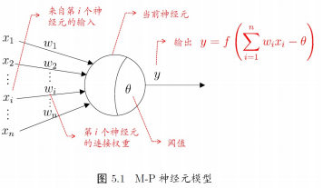
##### 1.2激活函数

#### 2.感知机与多层网络

##### 2.1 感知机
$y = f( \sum\limits_{i=1}^{n}w_ix_i - \theta)$, 可以容易实现 "与","或","非".
| 逻辑  |  实现  |
|---|----|
|“与” |  $w_1 = w_2 = 1, \theta = 2$  |
|“或”|  $w_1 = w_2 = 1, \theta =0.5$  |
|“非”|  $w_1 = -0.6, w_2 = 0, \theta = -0.5$  |

 

##### 2.2 感知机学习
训练样例 $(\bm{x},y)$ ,当前感知机输出 $\hat{y}$.
$w_i$ 变化 $\Delta w_i = \eta(y - \hat{y})x_i$, 学习率 $\eta \in (0,1)$ .

##### 2.3多层网络
求解非线性问题

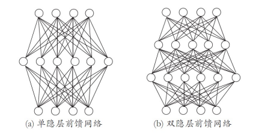

通过学习来调整各层之间的 $w$ 和 $\theta$.
#### 3.误差逆传播算法(BP)
##### 3.1 概念

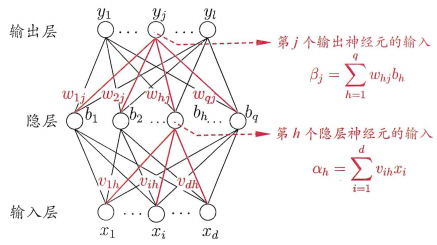
##### 3.2 符号

|记号|解释|
|----|----    |
|训练集 $D$ | $D = \{ (\bm{x}_i,y_i)\},\bm{x}_i \in R^d,y_i \in R^l,i = 1,2,\cdots,m$|
|$\theta_j$| 输出层第 $j$ 个神经元阈值|
|$\gamma_h$| 隐含层第 $h$ 个神经元阈值|
| $v_{ih}$ |输入层和隐层神经元之间的连接权重|
| $w_{hj}$ |隐层和输出层神经元之间的连接权重|
| $b_h$ |第 $h$ 隐层输出 $b_h=f(\alpha_h - \gamma_h)$|
|$\alpha_h$|第 $h$ 隐层输入 $\alpha_h=\sum\limits_{i=1}^{d}v_{ih}x_i$|
|$\hat{y}_j^k $|第 $j$ 输出层输出 $\hat{y}_j^k = f(\beta_j - \theta_j)$|
|$\beta_j$|第 $j$ 输出层输入 $\beta_j=\sum\limits_{i=q}^{d}w_{hj}b_h$|

##### 3.3 思路
样例 $(\bm{x}_k,\bm{y}_k)$,实际网络输出 $\hat{y}_k$.

误差函数 $E_k = \frac{1}{2}\sum\limits_{j=1}^{l}(\hat{y}_j^k - y_j^k)^2$

- [x] 优化参数 
- [x] 目标负梯度方向调整参数
- [x] 局部最小

给定学习率 $\eta$, 考虑 $w_{hj}$ 的优化 $\Delta w_{hj}$ "对 $E_k$ 求偏导"

$\Delta w_{hj} = - \eta \frac{\partial E_k}{\partial w_{hj}} = -\eta \frac{\partial E_k}{\partial \hat{y}_j^k} \cdot \frac{\partial\hat{y}_j^k}{\partial \beta_j}\cdot \frac{\partial \beta_j}{\partial w_{hj}}$

[^1]:Sigmoid 函数 $f(x) = \frac{1}{1+e^{-x}}$ 的导数 $f'(x) = f(x)(1-f(x))$

##### 3.4 关于单隐层神经元小结论

$b_h = \frac{\partial\beta_j}{\partial w_{hj}}$ 

$g_j = \frac{\partial E_k}{\partial \hat{y}_j^k} \cdot \frac{\partial\hat{y}_j^k}{\partial \beta_j} = (\hat{y}_j^k -y_j^k)\cdot f'(\beta_j -\theta_j)$ [^1] $=(\hat{y}_j^k -y_j^k)\cdot \hat{y}_j^k(1-\hat{y}_j^k)$

$e_h = -\frac{\partial E_k}{\partial b_h}\cdot \frac{\partial b_h}{\partial \alpha_h}= -\sum\limits_{j=1}^{l}\frac{\partial E_k}{\partial \beta_j}\cdot \frac{\partial\beta_j}{\partial b_h}\cdot f'(\alpha_h-\gamma_h) = \sum\limits_{j=1}^{l}g_i w_{hj}b_h (1-b_h)$

$\Delta w_{hj} = \eta g_j b_h$

$\Delta \theta_j = -\eta g_j$

$\Delta v_{ih} = \eta e_h x_i$

$\Delta \gamma_h = -\eta e_h$

##### 3.5 累计 BP 算法
优化目标是整个训练集累计误差 $E = \frac{1}{m} \sum\limits_{k=1}^{m} E_k$.
读取<u>整个训练集</u>一遍再进行参数更新

##### 3.6 缓解过拟合
早停：若训练误差降低，但验证误差升高，则停止训练
正则化：$E = \lambda\frac{1}{m}\sum\limits_{k=1}^{m}E_k +(1-\lambda)\sum\limits_{i}w_i^2$

#### 4.其他神经网络

RBF 网络：单隐层前馈神经网络, 它使用径向基函数作为隐层神经元激活函数, 而输出层则是隐层神经元输出的线性组合.
ART 网络：输出神经元一个激活其他全被抑制.

---
## 第六章
<h2 style="color: #2931d9ff; font-weight: normal;"> 支持向量机</h2>

#### 1.间隔与支持向量
什么是支持向量？

- [x] 支撑整个"道路"宽度的点
- [x] 边缘点
- [x] 满足 $y_i(\bm{w}^T\bm{x}_i +b) = 1$ 的点

样本 $(\bm{x}_i,y_i)$, 其中 $y_i = \pm 1$.

我们需要找到划分函数 $\hat{y} = \bm{w}^T\bm{x} + b$ 对样本进行分类

在离散的样本中，$\hat{y} > \theta_1$ 为正例， $\hat{y} < \theta_2$ 为正例,中间不希望有样本

临界线 $\bm{w}^T\bm{x} + b = \theta_1$, $\bm{w}^T\bm{x} + b = \theta_2$.

齐次归一临界线：$\bm{w'}^T\bm{x} + b' = 1$, $\bm{w'}^T\bm{x} + b' = -1$.

即在新的划分函数 $\hat{y}>1$ 正例，$\hat{y} < -1$ 反例.

寻找参数 $\bm{w}$ 和 $b$,使得间隔 $\gamma = \frac{2}{\|\bm{w}\|}$ 最大，即求 $\frac{\|\bm{w}\|}{2}$最小.

满足所有点划分正确 $y_i(\bm{w}^T\bm{x}_i +b) \geq 1, i=1,2,\cdots,m$.

#### 2.对偶问题

现在的问题：求 $\frac{1}{2}\|\bm{w}\|$ 最小值 $\iff$ 求 $\frac{1}{2}\|\bm{w}\|^2$ 最小值.
约束条件：$y_i(\bm{w}^T\bm{x}_i +b) \geq 1$ $\iff$ $-(y_i(\bm{w}^T\bm{x}_i +b) - 1)\leq 0$
##### 拉格朗日乘子法
拉格朗日函数： $L(\bm{w},b,\bm{\alpha}) = \frac{1}{2}\|\bm{w}\|^2 - \sum\limits_{i=1}^{m}\alpha_i\big(y_i(\bm{w}^T\bm{x}_i+b)-1\big)$

分别对 $\bm{w}$ , $b$ 求偏导取零有：$\bm{w} = \sum\limits_{i=1}^{m}\alpha_iy_i\bm{x}_i$,$\sum\limits_{i=1}^{m}\alpha_iy_i = 0$.

问题转化为：$\min\limits_{\alpha}\frac{1}{2}\sum\limits_{i=1}^{m}\sum\limits_{j=1}^{m}\alpha_i\alpha_jy_iy_j\bm{x}_i^T\bm{x}_j -\sum\limits_{i=1}^{m}\alpha_i$

最终模型：$f(x) = \bm{w}^T\bm{x} + b = \sum\limits_{i=1}^{m}\alpha_i y_i \bm{x}_i^T\bm{x} + b$

$KKT$ 条件：

$$\begin{cases}
\alpha_i \geq 0\\
y_if(\bm{x}_i) \geq 1\\
\alpha_i(y_if(\bm{x}_i) - 1) = 0
\end{cases}$$

解的稀疏性：$y_if(\bm{x}_i) > 1$ 则 $\alpha_i = 0$ 最终模型仅与支持向量有关

##### SMO
现在的约束：$\sum\limits_{i=1}^{m}\alpha_iy_i = 0$

###### 思路：
1.选取需要更新的变量 $\alpha_i$ 和 $\alpha_j$
2.固定其他 $\alpha$ 参数

#### 3.核函数
无法找到能划分两类样本的超平面？
- [x] 映射高维空间

观察最终模型：$f(x) = \bm{w}^T\bm{x} + b = \sum\limits_{i=1}^{m}\alpha_i y_i \bm{x}_i^T\bm{x} + b$,仅与内积有关.
所以将 $\bm{x}$ 映射为 $\phi(\bm{x})$ 也只和 $\phi(\bm{x_i})^T\phi(\bm{x_j})$ 有关

##### 3.1 基本想法
不显式设计核映射，而是设计核函数：$\kappa(\bm{x}_i,\bm{x}_j) = \phi(\bm{x}_i)^T\phi(\bm{x}_j)$.

##### 3.2 常见核函数

| 名称 | 表达式 | 参数 |
| :--- | :--- | :--- |
| **线性核** | \(\kappa(\mathbf{x}_i, \mathbf{x}_j) = \mathbf{x}_i^T \mathbf{x}_j\) |  |
| **多项式核** | \(\kappa(\mathbf{x}_i, \mathbf{x}_j) = (\mathbf{x}_i^T \mathbf{x}_j)^d\) | \(d \geq 1\) 为多项式的次数 |
| **高斯核** | \(\kappa(\mathbf{x}_i, \mathbf{x}_j) = \exp\left(-\frac{\|\mathbf{x}_i - \mathbf{x}_j\|^2}{2\sigma^2}\right)\) | \(\sigma > 0\) 为高斯核的带宽 (width) |
| **拉普拉斯核** | \(\kappa(\mathbf{x}_i, \mathbf{x}_j) = \exp\left(-\frac{\|\mathbf{x}_i - \mathbf{x}_j\|}{\sigma}\right)\) | \(\sigma > 0\) |
| **Sigmoid核** | \(\kappa(\mathbf{x}_i, \mathbf{x}_j) = \tanh(\beta \mathbf{x}_i^T \mathbf{x}_j + \theta)\) | \(\tanh\) 为双曲正切函数，\(\beta > 0\)，\(\theta < 0\) |

#### 4.软间隔与正则化
还是难以找到线性可分？
- [x] 软间隔
- [x] 允许支持向量机有一些样本不满足约束

##### 4.1 0/1损失函数

最大化间隔同时，不满足约束的样本尽可能少 
$\min\limits_{\bm{w},b}\frac{1}{2}\|\bm{w}\|^2 + C\sum\limits_{i=1}^{m}l_{0/1}\big(y_i(\bm{w}^T\phi(\bm{x}_i)+b)-1\big)$

$l_{0/1} = \begin{cases}
1 & z < 0\\
0  &othrewise
\end{cases}$

##### 4.2 正则化
一般形式：
$\min\limits_{f} \Omega(f) + C\sum\limits_{i=1}^{m}l(f(\bm{x}_i),y_i)$
前者：结构风险，描述模型的一些性质
后者：经验风险，描述模型和训练数据的契合度

#### 5.支持向量回归
允许模型输出和实际输出存在 $2\epsilon$ 偏差

落入中间 $2\epsilon$ 样本不计入损失

---
## 第七章
<h2 style="color: #2931d9ff; font-weight: normal;"> 贝叶斯分类器</h2>

通过训练集概率分布预测 $\bm{x}$ 应该被分类到何处，建模 $P(c|\bm{x})$.

#### 1.基本理论
将样本 $\bm{x}$ 分到第 $i$ 类的条件风险：$R(c_i|\bm{x}) = \sum \limits_{j=1}^{N}\lambda_{ij}P(c_j|\bm{x})$
判定准则：$h^*(\bm{x}) = \argmin \limits_{c\in \mathcal{Y}}R(c |\bm{x})$.   选择风险最小的分类 

策略？
- [ ]  判别式
- [x]  生成式

#### 2.贝叶斯定理
如何得到 $P(c | \bm{x})$ ？

- [x] 已知 $P(c)$
- [x] 求 $P(\bm{x} |c)$
- [x] 使用贝叶斯定理: $P(c|\bm{x}) = \frac{P(c)P(\bm{x}|c)}{P(\bm{x})}$

#### 3.极大似然估计

##### 3.1 什么是似然？

我们看到了数据（结果）。
我们猜测是某个参数（原因）导致了它。
我们评估这个原因（参数值）的“像然程度”或“合理程度”。

一个精辟的总结（来自统计学家罗纳德·费舍尔）：
|   |解释|
|---|---|
|概率|是固定参数、变化数据时的密度|
|似然 |是固定数据、变化参数时的函数|

##### 3.2 怎么计算？

假定 $P(\bm{x}|c)$ 具有确定的概率分布形式，且由参数 $\theta_c$ 唯一确定，利用训练集 $D$ 来估计 $\theta_c$.

$D$ 中 第 $c$ 类样本 (好瓜or坏瓜) 集合 $D_c$ 的似然估计为： $P(D_c|\theta_c) = \prod\limits_{x\in D_c} P(\bm{x}|\theta_c)$.
取对数 $\hat{\theta_c} = \argmax\limits_{\theta_c}LL(\theta_c)=\log P(D_c|\theta_c) = \sum\limits_{\bm{x}\in D_c}\log P(\bm{x}|\theta_c)$.
假设 $d$ 个属性相互独立 $P(c|\bm{x})=\frac{P(c)P(\bm{x}|c)}{P(\bm{x})} = \frac{P(c)}{P(\bm{x})}\prod\limits_{i=1}^{d}P(x_i|c)$.
$P(x)$  对所有类别相同，于是对于$\bm{x}$ 的预测：
$h_nb(\bm{x})=\argmax \limits_{c\in \mathcal{Y}}P(c)\prod\limits_{i=1}^{d}P(x_i|c)$
其中 $P(c) = \frac{|D_c|}{|D|}$, $P(x_i|c) = \frac{|D_{c,x_i}|}{|D_c|}$
可以看到其实就是计算预测样本各个属性值在分类样本的占比乘积，然后选取最大的分类

##### 3.3 拉普拉斯修正

如果某个属性值在训练中没有出现过会出现0消除其他信息

令 $N$ 表示训练集 $D$ 中可能的类别数，$N_i$ 表示第 $i$ 个属性可能的取值数
$\hat{P(c)} = \frac{|D_c| +1}{|D|+N}$ , $\hat{P}(x_i|c) = \frac{|D_{c,x_i}|+1}{|D_c|+N_i}$

#### 4.半朴素贝叶斯

属性不一定满足"独立性假设"

- [x] 独依赖估计

假设每个属性在类别之外最多仅依赖一个其他属性
$P(c|\bm{x})\propto P(c)\prod\limits_{i=0}^{d}P(x_i|c,pa_i)$

两种常见的方法：
1.SPODE
假设所有属性都依赖同一属性，称为"超父"然后通过交叉验证等模型选择方法来确定超父属性.

2.TAN
以属性间的条件互信息为边的权重构建完全图，再利用最大帯权生成树算法，仅保留强相关属性间的依赖性

                                                

---
## 第八章
<h2 style="color: #2931d9ff; font-weight: normal;"> 集成学习</h2>

#### 1.个体与集成
多个学习器，最后投票处最终结果

- [x] 集成个体：好而不同

两大类：串行和并行

##### 1.1 串行-Boosting
每次调整训练数据的样本分布
下一次训练重点关照上一组错误率高的样本
组合的最终版各个学习器权重不一样(表现好者高)
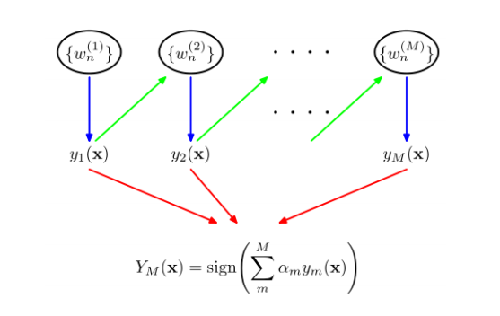

##### 1.2 AdaBoost算法
解决了什么？

- [x] 下一组训练的权重分配问题,即构造出了 $D_{t+1}$

最终 $D_{t+1}$ 基于 $D_t$ 如下：

**注意事项：**
数据分布的学习：
- [x] 重赋权法
- [x] 重采样法

重启动，避免训练过程过早停止

偏差-方差：降低偏差，可对泛化性能相当弱的学习器构造出很强的集成

##### 1.3 并行-Bagging
- [x] 个体学习器不存在强依赖关系
- [x] 并行化生成
- [x] 自助采样法

##### 1.4 Bagging

**思路：** 通过构建多个独立的模型，让它们投票或平均，从而获得更稳定、更可靠的预测。

1.从训练集 $D$ 中有放回地随机抽取 n 个样本，形成新的训练集 $D_t$

2.可使用包外预测：使用未采样的样本进行模型验证

##### 1.5 随机森林
**RF** 是bagging的拓展变种

从根节点开始，递归地：

1. **特征子集选择**：从 p 个特征中随机选择 m 个特征（通常 m = √p 或 log₂(p)）

2. **最佳分裂点选择**：从这 m 个特征中，选择最佳的分裂特征和分裂点（基于基尼指数或信息增益）

3. **节点分裂**：将数据划分为两个子集

4. **递归构建**：对每个子节点重复上述过程，直到：
    - 节点样本数小于阈值
    - 深度达到最大值
    - 节点纯度足够高

#### 2.结合策略
- [x] 平均法
- [x] 投票法
- [x] 学习法

#### 3.多样性 

##### 3.1 误差-分歧分解
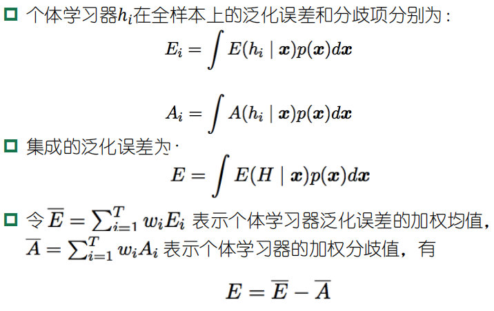

这个漂亮的式子显示:个体学习器精确性越高、多样性越大，则集成效果越好。称为误差-分歧分解

---
## 第九章
<h2 style="color: #2931d9ff; font-weight: normal;"> 聚类</h2>

**—— 无监督学习**
### 1.聚类
**目标：** 将数据样本划分为若干个通常不相交的“簇”

### 2.性能度量

**外部指标**： 将聚类结果与某个“参考模型”(reference model) 进行比较如 Jaccard 系数，FM 指数，Rand 指数
**内部指标**： 直接考察聚类结果，无参考模型，如 DB 指数，Dunn 指数等

#### 2.1 外部指标
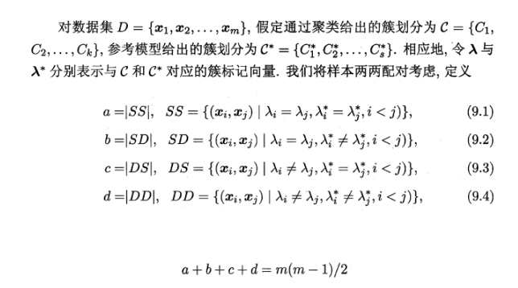

#### 2.2 内部指标
直接考察聚类结果而不用任何参考模型
如 DB 指数，Dunn 指数等

指标：簇内距离越短，不同簇距离越长

***聚类的好坏不存在绝对标准***

聚类本身没有好坏之分；当用于具体任务时，根据效果如何，有好坏之分

### 3.常见的聚类方法

#### 3.1 原型聚类

- [x] k-means k均值聚类
- [x] 学习向量量化（LVQ）
- [x] 高斯混合聚类

##### 3.1.1  k-means k均值聚类

**步骤：**
Step1: 随机选取k个样本点作为簇中心
Step2: 将其他样本点根据其与簇中心的距离，划分给最近的簇Step3: 更新各簇的均值向量，将其作为新的簇中心
Step4: 若所有簇中心未发生改变，则停止；否则执行Step 2

##### 3.1.2 学习向量量化

#### 3.2 密度聚类
划分多个等价类未必有簇中心

DBCSN：

#### 3.3 层次聚类

**AGNES**

---
## 第十章
<h2 style="color: #2931d9ff; font-weight: normal;"> 降维与度量学习</h2>

### 1.k近邻学习

要判断一个样本的类别，就看看它周围最近的K个邻居是什么类别，然后"随大流"。

出错率：$P(err) = 1- \sum\limits_{c \in \mathcal{Y}}P(c|\bm{x})P(c|\bm{z})$

最近邻分类器虽简单，但它的泛化错误率不超过贝叶斯最优分类器的错误率的两倍

### 2.低维嵌入
在高维情形下出现的数据样本稀疏、距离计算困难等问题

***降维***

多维缩放：
要求原始空间中样本之间的距离在低维空间中得以保持

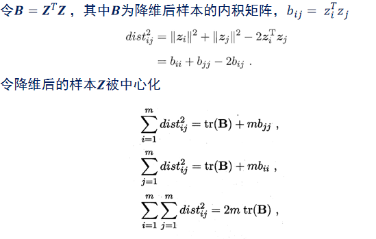

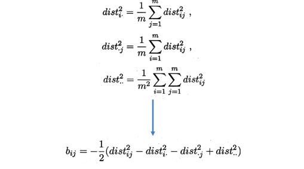

由此即可通过降维前后保持不变的距离矩阵D求取内积矩阵B

### 3.主成分分析

对于正交属性空间中的样本点，如何用一个超平面(直线的高维推广)对所有样本进行恰当的表达?

- [x] 最近重构性：样本点到这个超平面的距离都足够近
- [x] 最大可分性：样本点在这个超平面上的投影能尽可能分开

**PCA**
输入： 样本集，低维空间维数
算法：
1. 对所有样本进行中心化
2. 计算样本的协方差矩阵 $X^TX$
3. 对协方差矩阵做特征值分解
4. 取最大的 $d'$ 个特征值所对应的特征向量 $w_1,\cdots,w_{d'}$

输出:投影矩阵 $\bm{W} = (\bm{w_1,\cdots,w_{d'}}).$

降维后低维空间的维数d′通常是由用户事先指定，或通过在d′值不同的低维空间中对k近邻分类器进行交叉验证来选取较好的d′值。对PCA，还可从重构的角度设置一个重构阔值，然后选取使下式成立的最小 $d'$ 值：
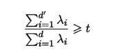

$PCA $仅需保留 $W$与样本的均值向量即可通过简单的向量减法和矩阵-向量乘法将新样本投影至低维空间中

### 4. 核化线性降维

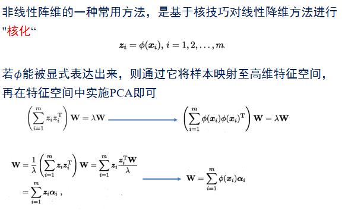

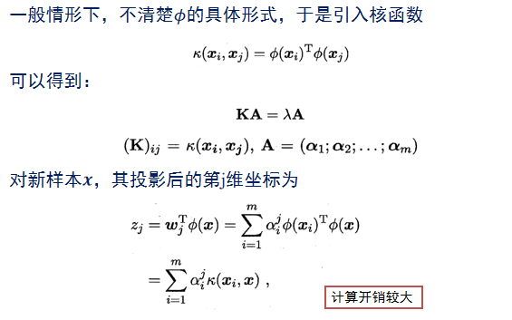

### 5.流形学习

---
## 第十一章
<h2 style="color: #2931d9ff; font-weight: normal;"> 特征选择与稀疏学习</h2>

### 1. 特征选择

选择任务相关的特征子集

关键点：子集搜索和子集评价

常见特征选择方法：
过滤式，包裹式，嵌入式

#### 1.1 过滤式选择
先用特征选择过程过滤原始数据，再用过滤后的特征来训练模型；特征选择过程与后续学习器无关

**Relief方法** 二分类
选择相关统计量最大的特征

相关统计量：

即猜错近邻大，猜中近邻小的度量

#### 1.2 包裹式选择

**目的** :就是为给定学习器选择最有利于其性能、“量身定做”的特征子集

***直接针对给定学习器进行优化***

**LVW:**
1. 在循环的每一轮随机产生一个特征子集
2. 在随机产生的特征子集上通过交叉验证推断当前特征子集的误差
3. 进行多次循环，在多个随机产生的特征子集中选择误差最小的特征子集作为最终解*    

#### 1.3 嵌入式选择与 $L_1$ 正则化

嵌入式特征选择是将特征选择过程与学习器训练过程融为一体，两者在同一个优化过程中完成，在学习器训练过程中自动地进行特征选择

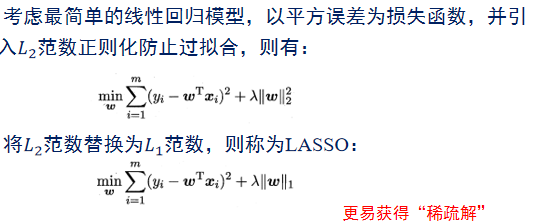

***$L_1$ 范数更容易获得稀疏解*** 特征点更少

### 2.稀疏表示与字典学习

为普通稠密表达的样本找到合适的字典，将样本转化为稀疏表示，这一过程称为字典学习

k 允许非零元素的最大数量

### 3. 压缩感知

能否利用接收到的压缩、丢包后的数字信号，精确重构出原信号?

---
## 第十二章
<h2 style="color: #2931d9ff; font-weight: normal;"> 半监督学习</h2>

### 1. 未标记样本
部分有标记部分无标记

半监督学习：让学习器不依赖外界交互、自动地**利用未标记样本来提升学习性能**。

`DeepSeek`：半监督学习就是用“少量昂贵的名师指导” + “大量免费的练习题”，来达到接近“全部名师指导”的效果，既省成本，效果又好

### 2.生成式方法

### 3.半监督SVM

