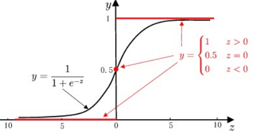
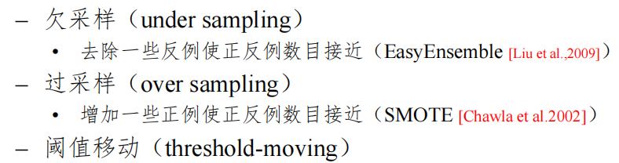
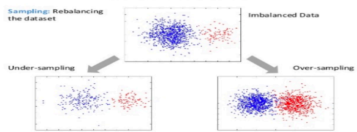

---	
comments: true	
---	
	
## 第三章	
<h2 style="color: #2931d9ff; font-weight: normal;"> 线性模型</h2>	
	
!!! tip "核心要点"	
    线性模型 = 最简单可解释的模型。回归用最小二乘，分类用 Sigmoid/Softmax。类别不平衡用重采样或代价敏感。	
	
#### 1.基本形式	
	
$f(\bm{x}) = w_1 x_1 + w_2 x_2 + \cdots + w_d x_d +b$	
	
向量形式：	
	
$f(\bm{x}) = \bm{w^T}\bm{x} + b$	
	
#### 2.回归任务	
	
单元目标：$f(x) = w x_i + b$,使得：$f(x_i) \simeq y_i$	
	
最小化均方误差：$E_{(w,b)} = \sum\limits_{i =1}^{m}(y_i - w x_i- b)^2$	
	
**多元线性回归：**	
$f(\bm{x_i}) = \bm{w}^T\bm{x_i} + b$， 数据有多个属性	
	
数据集 $D = \{(\bm{x_1},y_1),(\bm{x_2},y_2),\cdots,(\bm{x_m},y_m)\}$	
	
其中 $\bm{x_i} = (x_{i1},x_{i2},\cdots,x_{id}),y_i \in \mathbb{R}$	
	
令 $\bold{X} = \begin{pmatrix}	
x_{11} & x_{12} & \cdots& x_{1d} &1 \\	
x_{21} & x_{22} & \cdots& x_{2d} & 1\\	
\cdots    & \cdots    &\cdots&\cdots. & \cdots\\	
x_{m1} &x_{m2} & \cdots& x_{md} & 1	
\end{pmatrix}$ $=	
\begin{pmatrix}	
\bm{x}_1^T & 1\\	
\bm{x}_2^T & 1\\	
\cdots &\cdots\\	
\bm{x}_m^T & 1	
\end{pmatrix}$	
	
$\hat{\bm{w}} = (\bm{w} ; b)$,则：	
	
$\bold{f(\bold{X})} = \bold{X} \hat{\bm{w}}$ ，损失函数 $E_{\hat{\bm{w}}} = (\bm{y} - \bold{X}\bm{\hat{w}})^T(\bm{y} - \bold{X}\bm{\hat{w}})$	
	
一阶导： $\frac{\partial E_{\bm{\hat{w}}}}{\partial \bm{\hat{w}}} = 2 \bold{X} ^T (\bold{X}\bm{\hat{w}} - \bm{y})$.	
	
#### 3.二分类任务	
	
$z = \bm{w}^T\bm{x} + b$	
	
$y = g(z)$,根据$z$的值来进行分类	
	
单位阶跃函数：	
	

$$y=	
\begin{cases}	
0, & \textbf{z < 0}\\	
0.5, &\textbf{z = 0}\\	
1, &\textbf{z > 0}	
\end{cases}$$	
	
替代函数：$y = \frac{1}{1 + e^{-z}} = \frac{1}{1 + e^{-(\bm{w}^T\bm{x} + b)} }$	
	
	
	
**对数几率**：事件发生的概率比上不发生的概率的对数，即：	
	
$\ln \frac{p(y=1|\bm{x})}{p(y=0|\bm{x})} = \ln\frac{p(y = 1|\bm{x})}{1-p(y = 1|\bm{x})} = \bm{w}^T\bm{x} +b$	
	
!!! tip "对数几率回归"	
    虽叫"回归"，但用于分类。名字来源于输出是"对数几率"的线性模型。	
	
#### 4.多分类任务	
	
**OvR（One vs Rest）**：为每个类别训练一个二分类器（该类 vs 其他所有类），取置信度最高的类别。	
	
**OvO（One vs One）**：为每对类别训练一个二分类器，投票决定最终类别。类别数 $K$ → 需训练 $K(K-1)/2$ 个分类器。	
	
:arrow_right: OvO 训练快（单个分类器数据少但数量多），OvR 分类器少但每个训练数据多。	
	
**Softmax 回归**：多分类的直接推广，输出每个类别的概率：	
	

$$P(y=k|\bm{x}) = \frac{e^{\bm{w}_k^T \bm{x} + b_k}}{\sum_{j=1}^{K} e^{\bm{w}_j^T \bm{x} + b_j}}$$	
	
#### 5.类别不平衡	
	
当正负样本比例悬殊时（如 99:1），模型倾向于预测多数类。	
	
解决方法：	
- **重采样**：过采样少数类（SMOTE）或欠采样多数类	
- **代价敏感**：给少数类更高的误分类代价	
- **阈值移动**：调整分类阈值 $\frac{y}{1-y} > \frac{m^+}{m^-}$	
	
即 $\frac{y}{1-y} > 1$	
	
将其转化为类别平衡任务	
	
	
