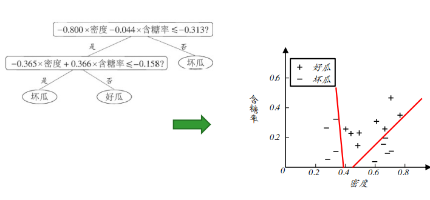

## 第四章
<h2 style="color: #2931d9ff; font-weight: normal;"> 决策树</h2>

#### 1.基本流程：基于树结构来进行预测
递归停止条件：

1. 当前节点包含的样本全都属于同一类，全为好瓜或者坏瓜 

2. 当前属性集为空，或者所有样本在所有属性上取值相同，即剩下的分类属性没区别，样本的“纹理”都=“清晰”，“脐部”都=“凹陷”

3. 当前结点包含的样本集合为空，看其父节点数量最多的类别，好瓜多则该属性下分类标记为好瓜

#### 2.划分选择

##### 2.1 概念
***信息熵：***  $Ent(D) = - \sum\limits_{k=1}^{\mathcal{Y}}p_k\log_2p_k$
值越小纯度越高，我们希望信息更纯，所以需要最大化减小信息熵

***信息增益：*** $Gain(D,a) = Ent(D) - \sum\limits_{v=1}^{V} \frac{|D^v|}{|D|}Ent(D^v)$ 
对于属性 $a$ 划分产生 $V$ 个结点 $Ent(D^v)$ 为每个结点的信息熵

***选择：*** 每次选择信息增益最大的属性划分

***缺点：*** 信息增益指标很明显偏好取值数目多的属性，也就是 $V$ 值越大信息增益会偏大

##### 2.2 $C4.5$决策树算法 
于是可以考虑规范化，使用"增益率 " $Gain\_ratio(D,a) = \frac{Gain(D,a)}{IV(a)}$ , 其中 $IV(a) = -\sum\limits_{v=1}^{V}\frac{|D^v|}{|D|}\log_2\frac{|D^v|}{|D|}$ 

##### 2.3 $CART$决策树

**基尼指数:** $Gini(D) = \sum\limits_{k=1}^{|\mathcal{Y}|}\sum\limits_{k'\neq k}^{}p_kp_{k'} = 1- \sum\limits_{k=1}^{|\mathcal{Y}|}p_k^2$
反映了从数据集中随机取两个样本，其类别标记不一致的概率，指数越小越纯

**关于属性$a$的基尼指数定义：**$Gini\_index(D,a) = \sum\limits_{v=1}^{V}\frac{|D^v|}{|D|}Gini(D^v)$

#### 3.剪枝处理
为什么剪枝？ 

- [x] 处理决策树过拟合 

用留出法预留一部分数据作为"验证集"进行性能评估

##### 3.1 预剪枝
1. 针对<u>训练集</u>，根据信息增益准则选择属性进行划分
2. 用<u>验证集</u>计算划分前后精度变化
3. 若提高精度，则划分

##### 3.2 后剪枝
先建树后根据剪枝前后验证集精度决定是否剪除

#### 4.连续值与缺失值

##### 4.1 连续值下的处理

- [x] 二分法
- [x] 离散化

1.考虑连续属性a在样本集上的n个不同取值，从小到大排列 $a^1,a^2,\cdots,a^n$,基于划分点$t$ 可以分为子集$D_t^+,D_t^-$.划分点集合 $T_a = \{ \frac{a^i+a^{i+1}}{2}|1 \leq i \leq n-1\}$,即相邻点的中值集合.

2.考察划分点，选最优：
$Gain(D,a) = \max\limits_{t \in T_a}Gain(D,a,t) = \max\limits_{t\in T_a}Ent(D) - \sum\limits_{\lambda \in \{-,+\}}\frac{|D_t^{\lambda|}}{|D|}Ent(D_t^{\lambda})$

 该属性还可以作为后代结点的划分属性🧐

##### 4.2 缺失值处理

令 $\tilde{D}$ 表示 $D$ 在属性 $a$ 上没有缺失的样.
假设属性 $a$ 有 $V$ 个取值 $\{a^1,a^2,\cdots,a^V\}$.
$\tilde{D}^v$ 表示 $\tilde{D}$ 中属性 $a$ 取值为 $a^v$ 的样本子集.
$\tilde{D}_k$ 表示 $\tilde{D}$ 中属于第 $k$ 类 $(k = 1,2,\cdots, |\mathcal{Y}|)$ 的样本子集.
假设对每个样本 $\bm{x}$ 赋予一个权重 $w_{\bm{x}}$ ,定义：

-   无缺失值样本所占比例： $\rho = \frac{\sum\limits_{\bm{x}\in \tilde{D}}w_{\bm{x}}}{\sum\limits_{\bm{x}\in D}w_{\bm{x}}}$
-   无缺失值样本中第 $k$ 类所占比例：$\tilde{p}_k = \frac{\sum\limits_{\bm{x}\in\tilde{D}_k}w_{\bm{x}}}{\sum\limits_{\bm{x}\in \tilde{D}}w_{\bm{x}}}$
-   无缺失值样本属性 $a$ 上取值 $a^v$ 比例：$\tilde{r}_v = \frac{\sum\limits_{\bm{x}\in \tilde{D}^v}w_{\bm{x}}}{\sum\limits_{\bm{x}\in\tilde{D}}w_{\bm{x}}}$

信息增益推广计算式：

$$
Gain(D,a) = \rho \times Gain(\tilde{D},a) = \rho \times \Bigg(Ent(\tilde{D}) - \sum\limits_{v=1}^{V}\tilde{r}_vEnt(\tilde{D}^v) \Bigg)

$$

其中 $Ent(\tilde{D}) = - \sum\limits_{k=1}^{|\mathcal{Y}|} \tilde{p}_k\log_2\tilde{p}_k$.

❇️ 对于属性 $a$  未知的 $\bm{x}$ 将其划分到 所有子结点 中,权重标记为 $\tilde{r}_v\cdot w_{\bm{x}}$

计算增益不考虑无属性，无属性划分按相应概率

#### 5.多变量决策树

非叶节点不再是单个属性而是多对的线性组合 $\sum\limits_{i=1}^{d}w_ia_i = t$ 线性分类器.

