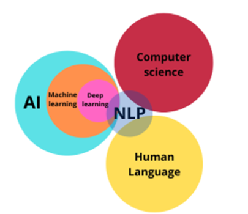

## Natural Language Processing (自然语言处理 NLP)

NLP 是一种通过计算机化手段分析文本的方法.

- **Alphabat:** symbols 的有限集  
E.g. $\Sigma = \{ 0,1\}, = \{A,C,G,T\}$
- **String:** Alphabat 里面的符号组成的有限序列  
  E.g. $s = 1010,x = AACAG,y = e$
- **Language:** strings 组成的集合  
E.g. $A = \{'Charles','Lance'\}, B = \{w|w 表示奇数\}, C = \empty$    

## NLP and AI

NLP 领域的交叉

- 是计算机科学 
- 人工智能 
- 语言学

## NLP 简短历史

### Phase 1: 1940年代末—1960年代末（规则）
**关键词：理性主义 · 符号处理 · 基于规则**

- **焦点**：机器翻译
- **语言对**：俄语 → 英语（冷战背景）
- **方法**：基于规则 + 双语词典（词对词映射）
- **代表事件**：1954年乔治城-IBM实验——首次公开演示机器翻译，虽然只有60句精心挑选的句子，但轰动一时
- **局限**：无法处理歧义和惯用语，系统脆弱，难以扩展

### Phase 2: 1960年代末—1970年代末（知识）
**关键词：世界知识 · 受限领域 · 意义表示**

- **特点**：研究者意识到光有语法不够，必须引入“世界知识”来构建和操作**意义表示**
- **代表系统**：BASEBALL 问答系统（Green 等人, 1961）
    - **领域受限**：只能回答关于棒球比赛的问题
    - **处理简单**：通过关键词匹配数据库，回答如“谁赢了7月4日的比赛？”
    - **意义**：早期“让机器理解概念”的尝试，是垂直领域对话系统的雏形

### Phase 3: 1970年代末—1980年代末（逻辑/编译）
**关键词：语法理论 · 逻辑推理 · 可扩展性**

- **痛点**：前两代系统输入受限 → 难以扩展，无法处理真实世界的开放文本
- **发展**：语言学家提出更完善的**语法理论**（如GPSG、LFG），试图用形式化方法覆盖更多语言现象
- **方法**：采用**语法-逻辑方法**，将自然语言转换为逻辑表达式，再进行推理
- **代表工具**：
    - SRI 核心语言引擎（Alshawi 等人, 1992）：通用语言理解平台，支持多种语言
    - Alvey 自然语言工具集（Briscoe 等人, 1987）：英国大规模NLP研究计划产物
- **局限**：人工编写规则和逻辑仍耗时耗力，难以覆盖所有语言现象

### Phase 4: 1990年代末—2010年代末（统计/学习）
**关键词：经验主义 · 数据驱动 · 统计学习**

- **范式转移**：从“让人教机器规则”转向“让机器从数据中自动学习”
- **标志性著作**：《统计自然语言处理基础》（Manning & Schütze, 1999）—— 一代NLP学者的“圣经”
- **技术特征**：
    - **浅层处理**：不追求深度语义分析，通过统计词频、搭配模式完成任务
    - **有限状态解析**：用有限状态机处理语言，效率高、速度快
    - **表层模式匹配**：在信息抽取等任务中效果显著
- **资源建设**（为统计提供“燃料”）：
    - **WordNet**（Fellbaum, 1999）：大规模英语词汇语义网，按词义组织
    - **英国国家语料库（BNC）**：1亿词规模的英语语料，用于建模和评估

### Phase 5: 现在进行时（深度学习）
**关键词：连接主义 · 端到端 · 预训练 · 大语言模型**

- **核心引擎**：深度学习（Deep Learning）
- **关键技术突破**：  
    1. **词嵌入（Word Embeddings）**
        - 将单词表示为稠密向量（如 Word2Vec, GloVe）
        - **意义**：让计算机理解“国王 - 男人 + 女人 ≈ 女王”  
    2. **序列到序列模型（Sequence-to-Sequence）**
        - 编码器-解码器架构，彻底改变机器翻译、摘要等任务
        - 输入输出长度可不同，真正实现“理解后再生成”  
    3. **注意力机制与记忆网络（Attention / Memory）**
        - 让模型在处理时“关注”输入的重要部分
        - Transformer 架构（2017）的核心：**“Attention is All You Need”**

    4. **预训练语言模型（Pre-trained Language Models）**
        - **先预训练**：在海量文本上学习通用语言知识（如 BERT, GPT）
        - **后微调**：针对具体任务少量调整即可使用
        - **意义**：真正实现“一鱼多吃”，NLP进入“预训练时代”

    5. **提示学习（Prompting）**
        - 不再微调模型，而是通过设计提示词让大模型直接完成任务
        - **例子**：GPT-3, ChatGPT —— 你只需要写“翻译成法语：你好”，模型就懂
        - **意义**：让人机交互更自然，打开通用人工智能的想象空间

---

### 总结：NLP 五阶段演进脉络

| 阶段 | 时间 | 范式 | 核心方法 | 代表资源/系统 |
| :--- | :--- | :--- | :--- | :--- |
| 1 | 1940s-1960s | 规则 | 词典 + 语法规则 | 乔治城-IBM实验 |
| 2 | 1960s-1970s | 知识 | 世界知识 + 受限领域 | BASEBALL 系统 |
| 3 | 1970s-1980s | 逻辑 | 语法理论 + 逻辑推理 | SRI 核心语言引擎 |
| 4 | 1990s-2010s | 统计 | 统计学习 + 浅层处理 | WordNet, BNC |
| 5 | 现在 | 深度学习 | 预训练 + 提示学习 | BERT, GPT, ChatGPT |

