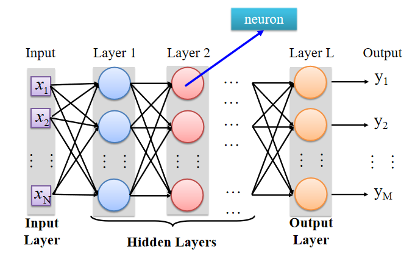

---	
comments : true	
---	
	
# 深度学习	
	
!!! tip "核心要点"	
    深度学习 = 神经网络堆叠。三个步骤：定义函数族 → 评价好坏 → 选择最佳。反向传播是训练核心。	
	
- [x] 定义 a set of function	
- [x] 评价函数优良性	
- [x] 选择最佳函数	
	
## 机器学习	
	
机器学习  $\approx$  寻找一个函数	
数据集训练模型	
	
## 神经网络	
	
$z= a_1w_1 + ... +a_kw_k +... +a_Kw_K + b$.	
***Sigmoid Function***: $\sigma(z) = \frac{1}{1+e^{-z}}$.	
向前传递 $\sigma(z) \to a$.	
	
### 全连接神经网络	
	
	
	
### 输出层	
作为神经网络最后一层的激活函数	
$Softmax(z_i) = \frac{e^{z_i}}{\sum\limits_{j=1}^{K}e^{z_j}}$	
	
!!! warning "常见误区"	
    Sigmoid 用于二分类输出层，Softmax 用于多分类输出层。隐藏层现在基本用 ReLU（$max(0, x)$），因为能解决梯度消失问题。	
	
### 损失函数	
	
- **回归**：均方误差（MSE）$L = \frac{1}{n}\sum(y_i - \hat{y}_i)^2$	
- **二分类**：二元交叉熵 $L = -\frac{1}{n}\sum[y_i\log\hat{y}_i + (1-y_i)\log(1-\hat{y}_i)]$	
- **多分类**：分类交叉熵 $L = -\frac{1}{n}\sum y_i \log \hat{y}_i$	
	
### 反向传播（Backpropagation）	
	
链式法则逐层计算梯度，从输出层向输入层传播。	
	
核心公式：$\frac{\partial L}{\partial w} = \frac{\partial L}{\partial z} \cdot \frac{\partial z}{\partial w}$	
	
### 梯度下降	
	
$$w_{t+1} = w_t - \eta \cdot \frac{\partial L}{\partial w}$$	
	
- $\eta$：学习率，太大震荡太小收敛慢	
- SGD：每次随机抽一个 batch 计算梯度，比全量梯度更快